# Movie_Web_Application

- 아직 명세가 나오지 않았다.

# `05.17`

### 4조 : 김재우, 이광교

- 아직 명세가 나오진 않았지만 어떤 framework를 사용할 것인지와 역할 분배에 대해 이야기했다.

#### :melon: Framework : Django, Vue

#### :grapes: 역할 분배 : Front와 Back을 따로 나누지 않고 함께 !

- accounts와 movies를 나눠서 구현하면서 피드백하고 구현 후 서로 설명해주고 디버깅 하기 !
- 처음에는 좀 더 시간이 걸릴 수 있지만 완벽히 `Server`를 구현한 후 `Client`를 구현하면서 후반에 시간을 단축시킨다 !
- 추가적인 기능 생각해보기 !

<br>

#### :orange: 오늘 한 것 !

1. Framework 정하기

2. Front와 Back에 관련하여 역할 정하기

3. Django를 사용하여 community json으로 출력해보기 → 출력 실패,,
   - 생각보다 Django를 많이 잊어버려서 공부가 필요하다는 것을 느꼈다. 
   - html 파일이 아닌 json 파일로 출력해야하기 때문에 `serializers`에 대한 공부 필요 !!

<br>

<br>

# `05.18`

### 1. Gitlab 협업

- Server와 Client 두 개의 프로젝트를 만들어서 구현하기로 했다.
- 아직 명세가 나오지 않았기 때문에 기본적인 틀만 만들고 고의적으로 Conflict를 만들어보는 경험을 했다.

#### :bomb: Conflict 만드는 방법

- 각자 master의 branch를 만든다.

- 같은 부분을 수정하고 push한다.

- A와 B branch에서 각각 a와 b를 수정을 했다고 하면 A와 master가 merge할 때는 충돌이 나지 않지만 이렇게 merge한 것을 pull 받아서 B와 merge를 하게 되면 충돌이 일어난다.

- 아래의 에러메세지가 나온다.

  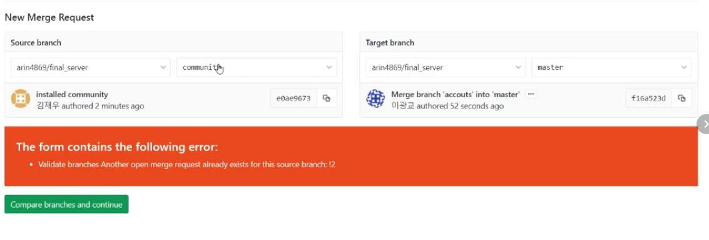

  → 같은 부분을 수정했기 때문에 둘 중 어떤 것을 사용할지 정해야 한다.

#### :bulb: 해결 방법 1(Gitlab merge)

- Gitlab에서 merge를 하게 된다면 a와 b 둘 중 하나를 선택해서 merge할 수 있다.
- merge한 후 뜬 오류에서 옆에 보면 내용을 확인하고 바꿀 수 있는 부분이 있다.

#### :bulb: 해결 방법 2(Local merge)

- 로컬에서 merge 하는 방법으로 이 방법을 사용하면 a, b 둘 중 하나만 선택할 수도 있고 a, b 둘 다 선택할 수 있다 !  → 만약에 둘 다 merge 되는 것을 원한다면 로컬에서 merge !!

- 순서

  ```shell
  # testA branch 생성
  $ git branch testA
  
  # 해당 branch로 이동
  $ git switch testA
  
  # 수정하고 add, commit
  # push 할 때는 해당하는 곳에 push
  $ git push origin testA
  
  # merge할 때는 master branch에서!!
  $ git merge testA
  # -> 충돌이 일어나서 그 부분을 보여줌 -> 두 개를 다 선택하려면 both ~ 선택 !
  
  # merge 성공 ! 다시 git, commit, push
  # 로컬 branch 삭제
  $ git branch -d testA
  # 로컬에서만 삭제된 것이므로 Gitlab에서도 삭제를 해줘야한다.
  ```

#### :bulb: 해결한 후 branch 삭제 !

- branch 삭제는 동기화가 되지 않기 때문에 각각의 위치에서 삭제해줘야한다. Local에서 merge하고 branch를 삭제했다면 Gitlab에서도 branch를 따로 삭제해줘야한다. 반대의 경우도 마찬가지로 로컬과 Gitlab에서 각각 삭제해줘야한다.

<br>

#### :orange: 오늘 한 것

1. **`프로젝트를 시작하기 전에 미리 Conflict를 경험`하였다. 어느정도 진행 후에 에러를 보게 되는 것보다는 미리 경험하고 시작하자는 생각이었는데 좋은 선택이었던 것 같다.**

2. **명세가 나오지 않아서 구체적으로는 힘들지만 어느정도 예상되는 부분이 있기 때문에 각자 UI를 생각해서 수요일 오후 4시에 보기로 했다 !**

<br>

#### :watermelon: 해야할 것

- **각자 UI 생각해오기 !**

<br>

<br>

# `05.19`

### 1. UI 구성

#### :bulb: 광교

- 그림으로 표현해보았다 !

  | 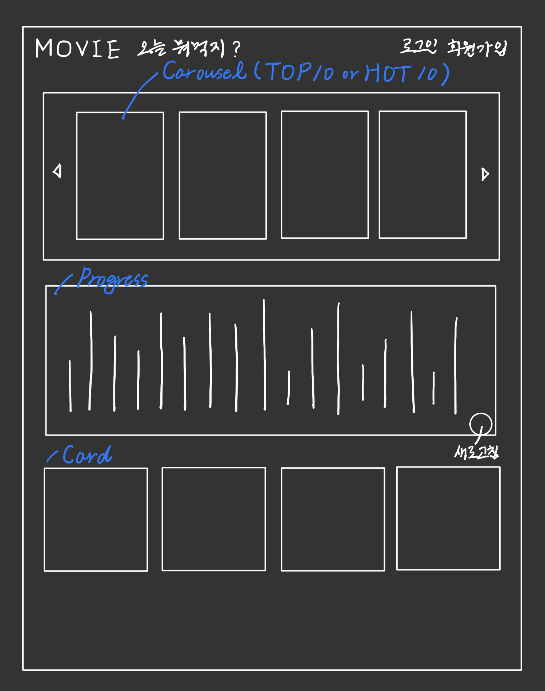 | 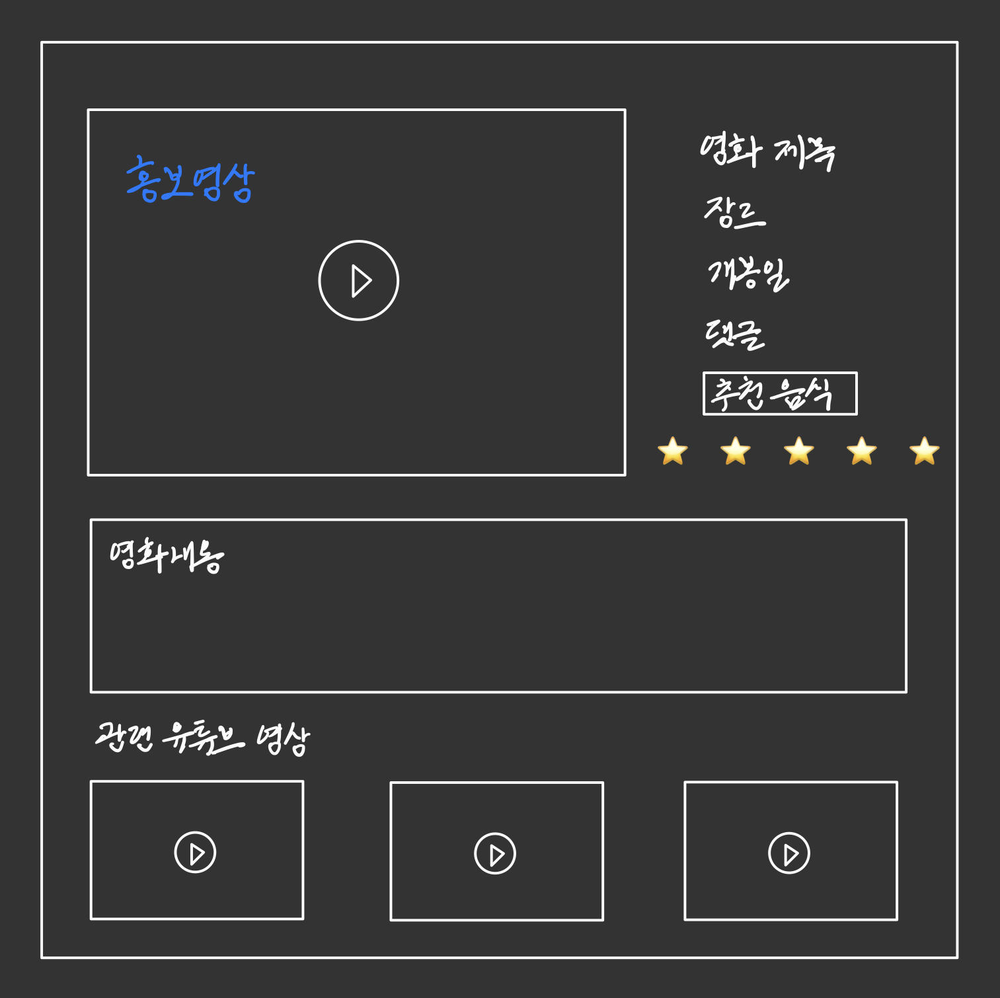 |
  | -------------------------------------------------------- | -------------------------------------------------------- |
  | 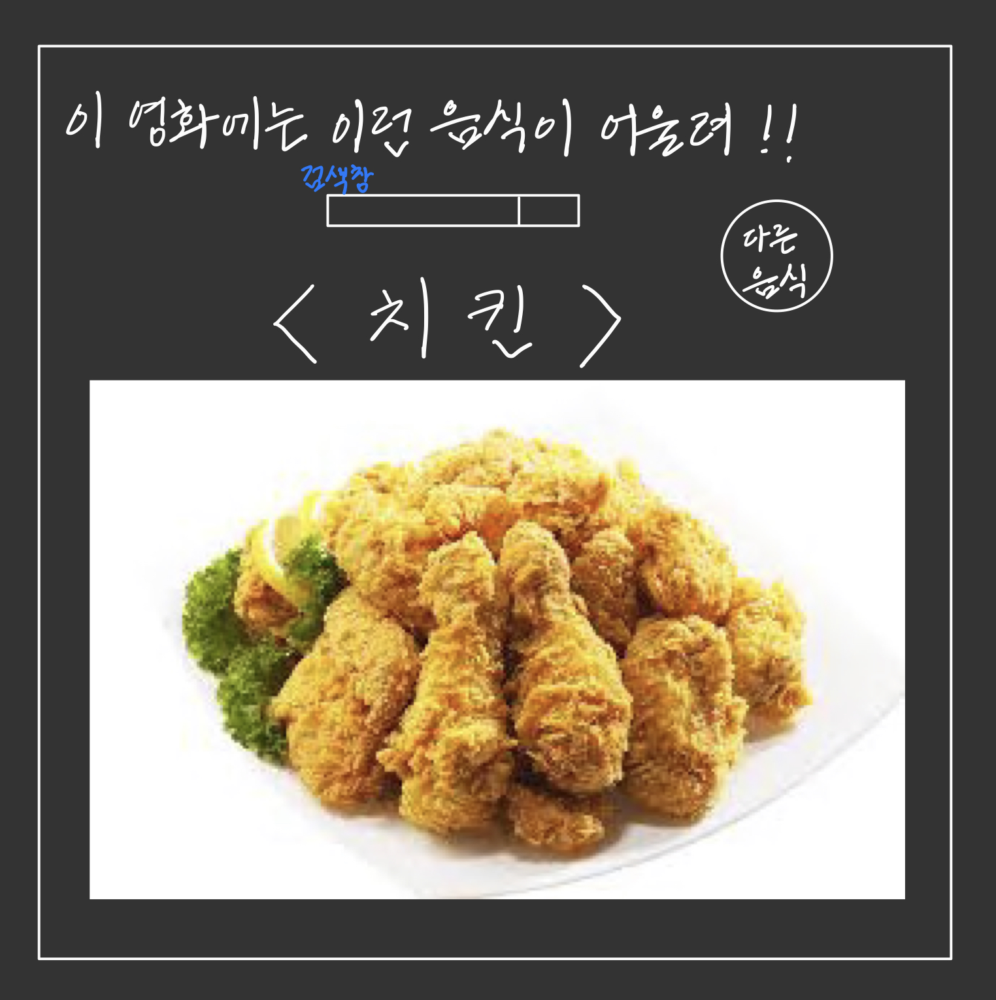 | 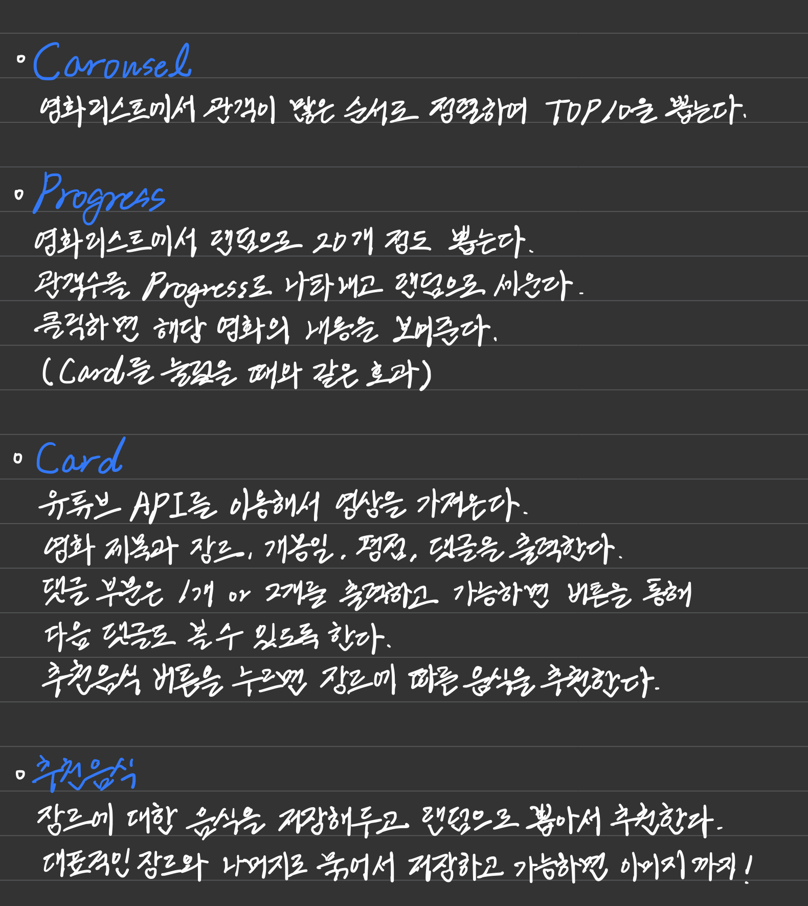 |

- 메인페이지를 Carousel과 Progress, Card를 통해서 표현해보았다.

- Top10을 Carousel로 표현하였다. (관객수 기준)

- Progress는 재미요소를 넣은 추천 시스템이다. 주식차트, 코인차트와 같이 영화 리스트에서 랜덤으로 뽑은 20개를 관객수를 그래프량으로 나타내고 그것을 다시 랜덤으로 줄 세우는 것이다. 해당 영화의 제목은 볼 수 없고 단순히 `차트만`보고 선택하여 영화의 디테일한 정보를 얻게 된다. 

- Cart는 영화 리스트에 있는 목록을 출력한다.

- 2번째에 있는 그림은 영화의 정보를 나타내는 부분이다. 제목, 장르, 개봉일, 댓글, 평점(가능하다면 별 개수까지?)을 보여주고 추천 음식을 클릭하면 3번째 그림과 같이 나오게 된다.

- 첫번째 그림 상단에 있는 오늘 뭐먹지도 3번째 그림과 같은 정보를 출력하는 것을 생각했다.

#### :bulb: 재우

- ppt를 만들어오셨다.. 그림으로 그려온게 죄송해지는,,, 죄송합니다ㅠㅠㅠ
- 중략

#### 종합

- 로그인과 회원가입, 프로필 부분은 내가 구성해오지 않았던 부분이었고 재우님이 만들어오신 UI가 심플하면서도 명확해서 선택하여 사용할 것 같다. ___Simple is the best___
- 메인페이지 부분은 재우님이 만들어오신 부분과 비슷하게 갈 거 같다. 현재 많은 사람들이 사용하는 Netfilx와 왓챠, wavve 등의 UI와 비슷한 형식으로 만들어졌고 내가 그려온 것이 포함되어 있는 UI였다. 그리고 메인페이지에 랜덤 추천 이라는 버튼이 있었기 때문에 내가 그려온 UI가 그 안에 들어가는 것이 맞는 것 같다.
- Card를 눌렀을 때 나오는 부분은 아직 명확하게 정해지지는 않았지만 포스터를 넣느냐와 영상을 넣느냐, 리뷰의 위치 등을 좀 더 상의해봐야할 것 같다. 영상을 가져오는 것을 생각했지만 전체적인 UI를 그려보면서 '시간적인 여유가 있을까' 하는 고민이 생겨서 진행과정을 보면서 수정할 것 같다.
- 내가 그려온 부분은 전체적인 UI보다는 추가 기능(추천) UI에 가까웠던 것 같다😂 로그인과 회원가입, 프로필과 같은 부분은 따로 그리지 않고 추가 기능위주로 생각해서 만들어온 UI였기 때문에 차이가 있었던 것 같다. 전체적으로 사용하는 데이터가 비슷했기 때문에 좀 더 포괄적인 UI를 선택했고 심플하면서 직관적으로 보이게 할 예정이다. 추가 기능 UI는 시간을 보면서 추가할 예정이다.

<br>

### 2. ERD 구성

- 아직 명세가 나오지 않았지만 전체적인 ERD를 생각해보았다.

  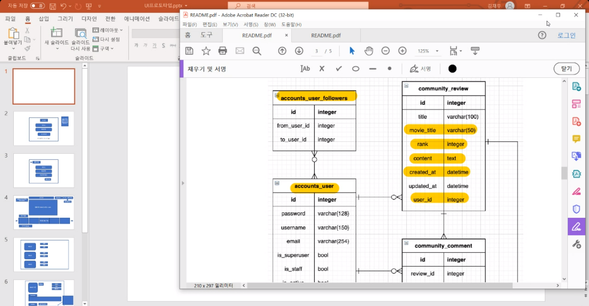

- User와 Review, Review와 Comment(만들게 된다면)는 1: N 관계로 진행할 것이고 User와 follow는 M : N 관계로 할 것이다.(프로필을 만들 것이기 때문에)
- 둘 다 고민을 한 부분이 찜하기 부분이었는데 Movie Data를 Django DB에 받아와서 할 것인지, Local에 저장할 것인지에 대한 고민이었다.
- 이 부분은 M : N 관계에 대해서 헷갈려서 재우님한테 많이 물어봤다.(재우님👍) 'user를 ManyToManyField로 Movie에 넣게 된다면 Movie 데이터를 받아올 때 user도 있어야하지않나' 라는 고민을 했고 재우님의 말과 이전 내용들을 보니 ManyToManyField를 사용할 경우에는 같이 넣어줄 필요가 없다는 것을 알게 됐다.(공부하자..😱)
- Local로 찜하기를 구현하게 되면 더 쉬울 것 같지만 배포를 생각한다면 DB에 데이터가 있는 것이 맞기 때문에 고민했고, DB로 한다면 M : N으로 하는 것이 맞는지를 고민했다. 이 후 정리된 생각을 마침 들어와있었던 다른 조에게 물어보았고 M : N 관계로 가능할 것 같아서 선택했다 ! 대전 1반 최고🙌

<br>

### 3. TMDB DATA 받기

- DB로 구현하기로 했기 때문에 data를 잘 받아올 수 있는지 테스트 해보았다. POSTMAN을 이용했고 TMDB의 api_key를 이용해서 받아왔다. popular 데이터를 보니 약 30개 정도로 돼보였는데 더 많은 데이터를 가져오는 url를 발견하지 못했다. 아마도 내일 알려주지 않을까? 싶다.
- 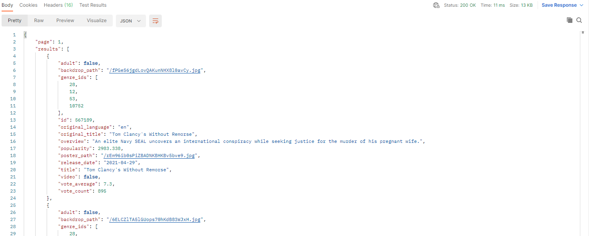

#### **오늘은 여기까지 !** 내일부터 본격적인 시작 화이팅~~!

<br>

#### :orange: 오늘 한 것

1. **UI 구성 토의**
2. **찜하기 구현 DB / Local 선택 → `DB`**
3. **Postman 이용해서 TMDB Data 받아오기**

<br>

#### :watermelon: 해야할 것

- **serializers 공부 !**
- **1:N, M:N 이해**
- **내일을 위한 휴식 !!!**

<br>

<br>

# `05.20` 

# :star: 프로젝트 시작 :star:

### :bulb: 작성 Tip !

1. 프로젝트가 어떤 모습일지 그림 그리기
   - 종이나 프로그램(ex. figma) 상관 없이 그려보는 것이 중요!
2. 그림을 보고 어떤 기능이 필요할지를 글로 정리
   - 특히 서버랑 프론트랑 통신이 필요한 기능이라면 꼭 정리
3. 프론트는 컴포넌트 구조 짜기 
   - 예를들어 page가 5개 필요하다 그러면, 라우터를 붙이고, 해당하는 빈 컴포넌트를 만들고 하는 형태로..
4. 백엔드는 데이터 모델링 하기
   - 예를들어 todo 모델링을 한다면 어떤 필드가 있어야하는지, user모델이랑 관계는 어떻게 되는지 등등..
5. 프론트, 백엔드 둘 다 2번에서 정리한 글을 바탕으로 개발을 시작 !

<br>

### :melon: 시작 전 사용프로그램 정리

1. **GitLab**
   - 각자의 작업을 하고 파일을 합치는 과정을 담당, branch를 사용하여 자신의 부분을 작업한다.
2. **Notion**
   - 필요한 내용을 기록, 일정 공유, 토의 내용, 몰랐던 부분 등을 기록해간다.
3. **Mettermost**
   - 메세지나 간단한 파일들을 공유한다.
4. **Django**
   - 이용하여 Back-end(server)를 개발한다.
5. **Vue.js**
   - 이용하여 Front-end(client)를 개발한다.

<br>

### 1. UI 작성

- UI를 그리는 작업은 미리그려본 UI를 사용했다. 명세를 보면서 꼭 필요한 기능을 먼저 구현하기로 했고 이 후에 추가적인 기능을 붙이기로 했다. 

|  | 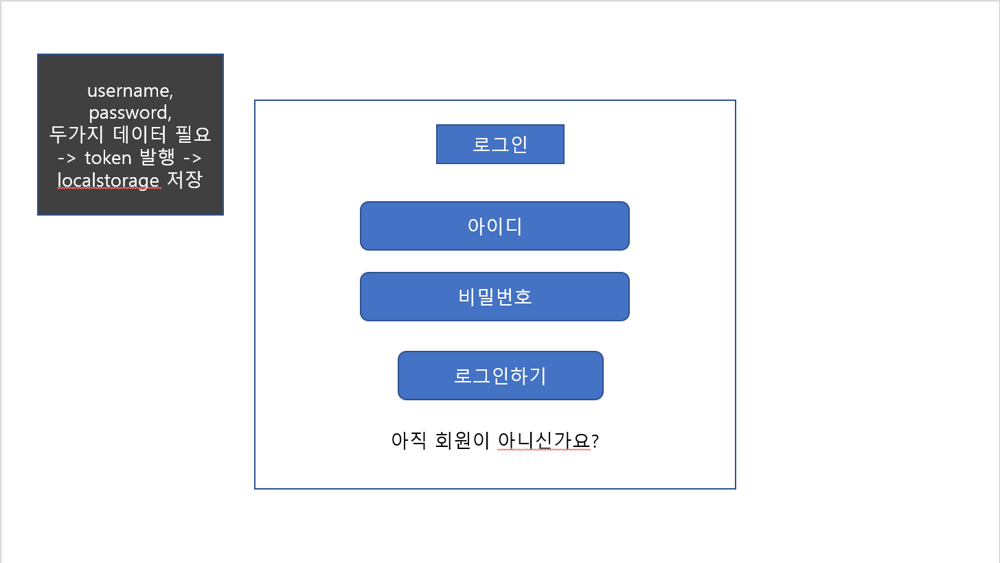 |
| ------------------------------------------------------------ | ------------------------------------------------------------ |
| 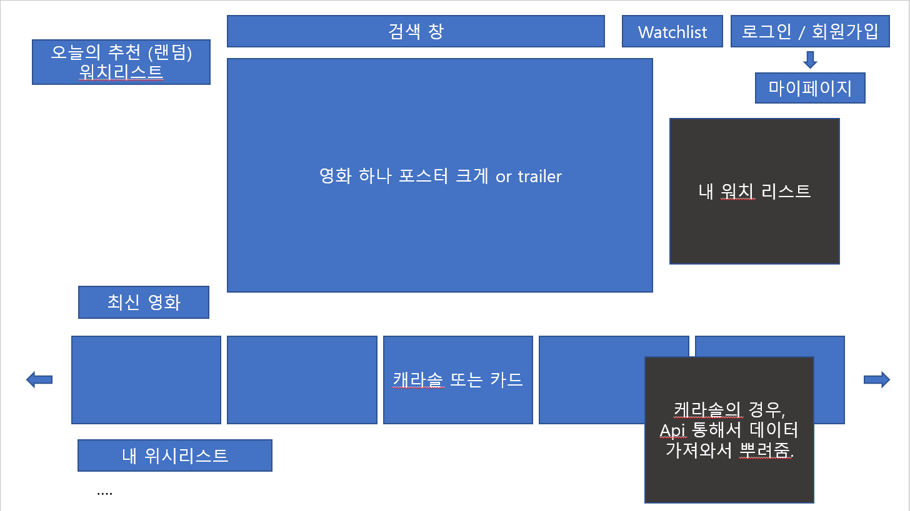 | 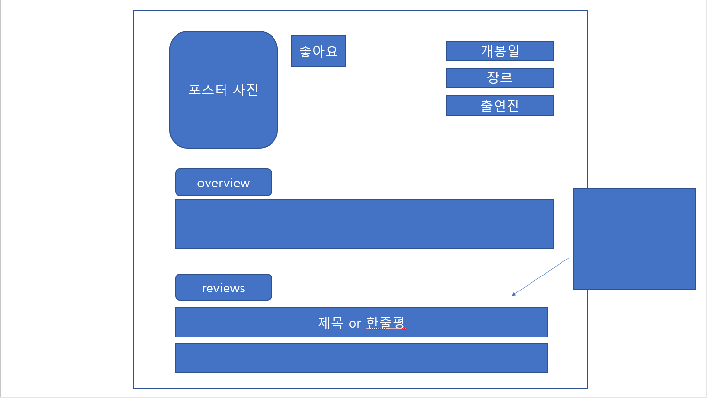 |
| 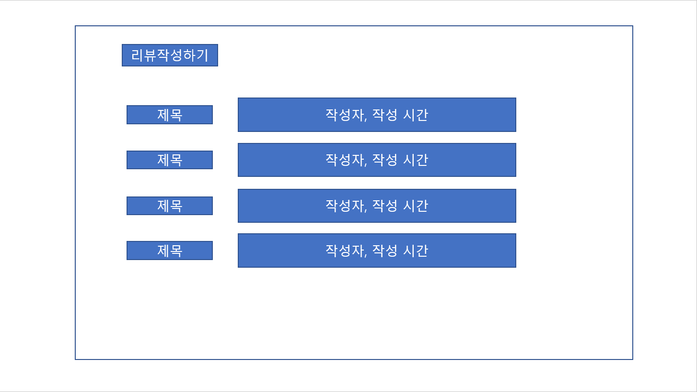 | 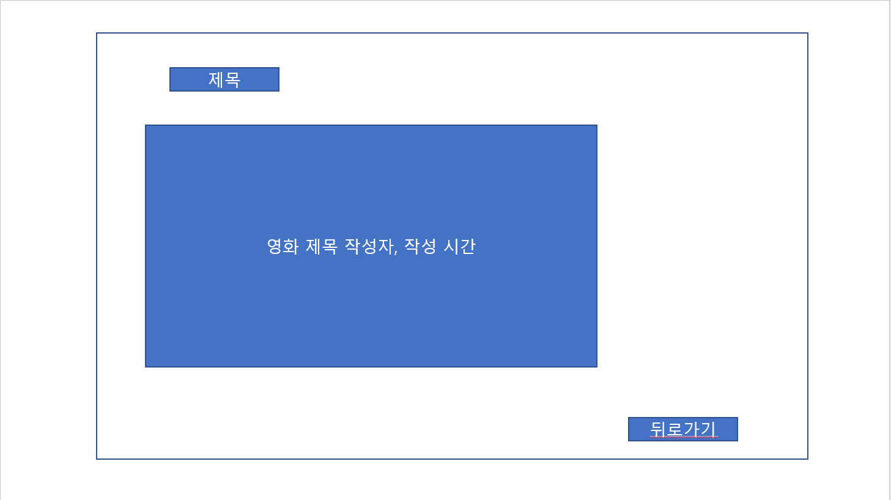 |
| 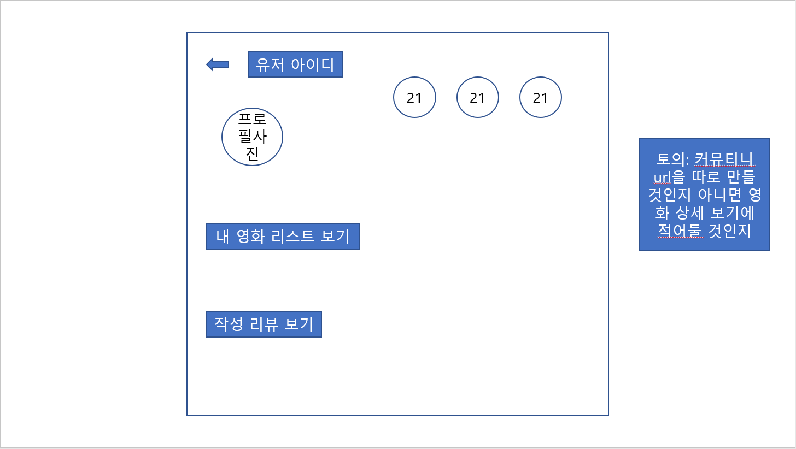 | 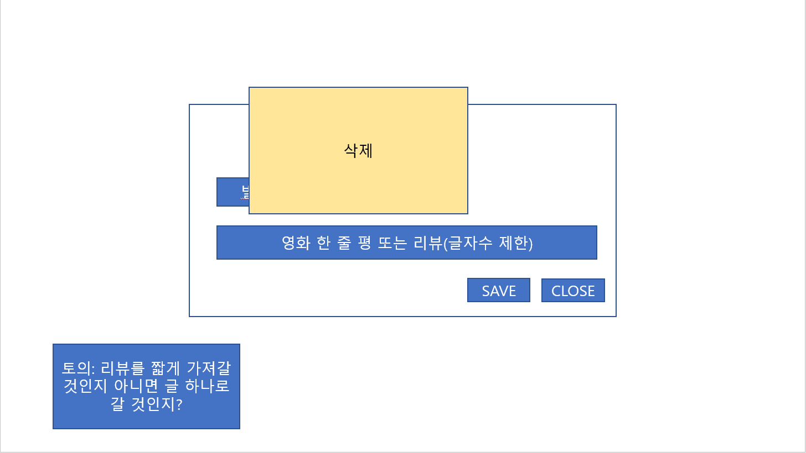 |

- 처음에 작성한 부분에서 토의를 통해 약간 수정된 부분도 반영하였다.
- Tip 2번의 글처럼 먼저 API를 통해서 가져와야 하는 부분들을 검은색 창으로 적어두었다.

<br>

### 2. ERD 구성

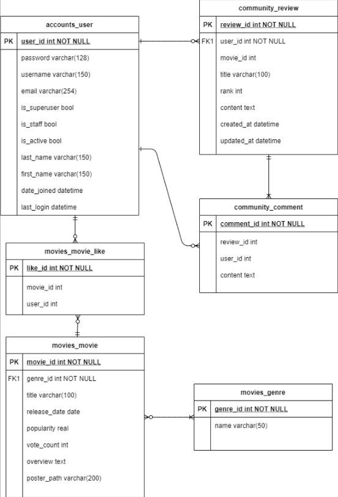

- user와 review 1:N,  review와 comment 1:N 관계를 설정했다.
- user와 movie는 M:N 관계를 설정했고 중간에 찜하기를 하기 위한 movie_like를 넣었는데 이부분은 확실하지 않아서 바뀔 수도 있을 것 같다.
- user, review, comment의 column은 대략적으로 작성했고 추후에 필요한 column이 있으면 추가, 삭제할 예정이다.
- movie와 genre부분의 column은 받아오는 movie.json에 기반하여 작성되었다. 

<br>

### 3. movie data 받아오기

- 이 부분은 가지고 있는 movies.json 파일을 이용했다. 100개의 데이터가 있기 때문에 기준 조건은 만족했고 loaddata를 통해서 받아올 수 있었다.

  :open_file_folder: 파일을 받아오기 위해서는 `fixtures`라는 폴더 안에 movies.json을 넣어주어야한다 !

- 가져오기는 했지만 이후의 작업을 생각한다면 API를 통해서 가져온 후 json으로 변환하여 사용해야될 것 같다. 

→ 팀원과 상의하면서 진행할 예정, 먼저 빠르게 필수적인 기능을 구현하고 바꿀 것 같다.

