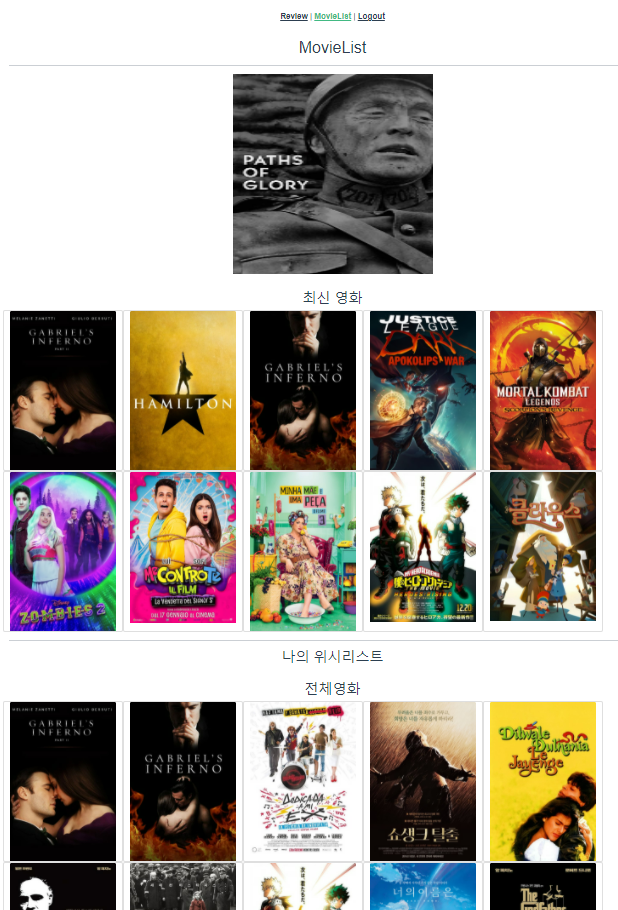

# Movie_Web_Application

- 아직 명세가 나오지 않았다.

# `05.17`

### 4조 : 김재우, 이광교

- 아직 명세가 나오진 않았지만 어떤 framework를 사용할 것인지와 역할 분배에 대해 이야기했다.

#### :melon: Framework : Django, Vue

#### :grapes: 역할 분배 : Front와 Back을 따로 나누지 않고 함께 !

- accounts와 movies를 나눠서 구현하면서 피드백하고 구현 후 서로 설명해주고 디버깅 하기 !
- 처음에는 좀 더 시간이 걸릴 수 있지만 완벽히 `Server`를 구현한 후 `Client`를 구현하면서 후반에 시간을 단축시킨다 !
- 추가적인 기능 생각해보기 !

<br>

#### :orange: 오늘 한 것 !

1. **Framework 정하기**

2. **Front와 Back에 관련하여 역할 정하기**

3. **Django를 사용하여 community json으로 출력해보기 → 출력 실패,,**
   - 생각보다 Django를 많이 잊어버려서 공부가 필요하다는 것을 느꼈다. 
   - html 파일이 아닌 json 파일로 출력해야하기 때문에 `serializers`에 대한 공부 필요 !!

<br>

<br>

# `05.18`

### 1. Gitlab 협업

- Server와 Client 두 개의 프로젝트를 만들어서 구현하기로 했다.
- 아직 명세가 나오지 않았기 때문에 기본적인 틀만 만들고 고의적으로 Conflict를 만들어보는 경험을 했다.

#### :bomb: Conflict 만드는 방법

- 각자 master의 branch를 만든다.

- 같은 부분을 수정하고 push한다.

- A와 B branch에서 각각 a와 b를 수정을 했다고 하면 A와 master가 merge할 때는 충돌이 나지 않지만 이렇게 merge한 것을 pull 받아서 B와 merge를 하게 되면 충돌이 일어난다.

- 아래의 에러메세지가 나온다.

  

  → 같은 부분을 수정했기 때문에 둘 중 어떤 것을 사용할지 정해야 한다.

#### :bulb: 해결 방법 1(Gitlab merge)

- Gitlab에서 merge를 하게 된다면 a와 b 둘 중 하나를 선택해서 merge할 수 있다.
- merge한 후 뜬 오류에서 옆에 보면 내용을 확인하고 바꿀 수 있는 부분이 있다.

#### :bulb: 해결 방법 2(Local merge)

- 로컬에서 merge 하는 방법으로 이 방법을 사용하면 a, b 둘 중 하나만 선택할 수도 있고 a, b 둘 다 선택할 수 있다 !  → 만약에 둘 다 merge 되는 것을 원한다면 로컬에서 merge !!

- 순서

  ```shell
  # testA branch 생성
  $ git branch testA
  
  # 해당 branch로 이동
  $ git switch testA
  
  # 수정하고 add, commit
  # push 할 때는 해당하는 곳에 push
  $ git push origin testA
  
  # merge할 때는 master branch에서!!
  $ git merge testA
  # -> 충돌이 일어나서 그 부분을 보여줌 -> 두 개를 다 선택하려면 both ~ 선택 !
  
  # merge 성공 ! 다시 git, commit, push
  # 로컬 branch 삭제
  $ git branch -d testA
  # 로컬에서만 삭제된 것이므로 Gitlab에서도 삭제를 해줘야한다.
  ```

#### :bulb: 해결한 후 branch 삭제 !

- branch 삭제는 동기화가 되지 않기 때문에 각각의 위치에서 삭제해줘야한다. Local에서 merge하고 branch를 삭제했다면 Gitlab에서도 branch를 따로 삭제해줘야한다. 반대의 경우도 마찬가지로 로컬과 Gitlab에서 각각 삭제해줘야한다.

<br>

#### :orange: 오늘 한 것

1. **`프로젝트를 시작하기 전에 미리 Conflict를 경험`하였다. 어느정도 진행 후에 에러를 보게 되는 것보다는 미리 경험하고 시작하자는 생각이었는데 좋은 선택이었던 것 같다.**

2. **명세가 나오지 않아서 구체적으로는 힘들지만 어느정도 예상되는 부분이 있기 때문에 각자 UI를 생각해서 수요일 오후 4시에 보기로 했다 !**

<br>

#### :watermelon: 해야할 것

- **각자 UI 생각해오기 !**

<br>

<br>

# `05.19`

### 1. UI 구성

#### :bulb: 광교

- 그림으로 표현해보았다 !

  |  |  |
  | -------------------------------------------------------- | -------------------------------------------------------- |
  |  |  |

- 메인페이지를 Carousel과 Progress, Card를 통해서 표현해보았다.

- Top10을 Carousel로 표현하였다. (관객수 기준)

- Progress는 재미요소를 넣은 추천 시스템이다. 주식차트, 코인차트와 같이 영화 리스트에서 랜덤으로 뽑은 20개를 관객수를 그래프량으로 나타내고 그것을 다시 랜덤으로 줄 세우는 것이다. 해당 영화의 제목은 볼 수 없고 단순히 `차트만`보고 선택하여 영화의 디테일한 정보를 얻게 된다. 

- Cart는 영화 리스트에 있는 목록을 출력한다.

- 2번째에 있는 그림은 영화의 정보를 나타내는 부분이다. 제목, 장르, 개봉일, 댓글, 평점(가능하다면 별 개수까지?)을 보여주고 추천 음식을 클릭하면 3번째 그림과 같이 나오게 된다.

- 첫번째 그림 상단에 있는 오늘 뭐먹지도 3번째 그림과 같은 정보를 출력하는 것을 생각했다.

#### :bulb: 재우

- ppt를 만들어오셨다.. 그림으로 그려온게 죄송해지는,,, 죄송합니다ㅠㅠㅠ
- 중략

#### 종합

- 로그인과 회원가입, 프로필 부분은 내가 구성해오지 않았던 부분이었고 재우님이 만들어오신 UI가 심플하면서도 명확해서 선택하여 사용할 것 같다. ___Simple is the best___
- 메인페이지 부분은 재우님이 만들어오신 부분과 비슷하게 갈 거 같다. 현재 많은 사람들이 사용하는 Netfilx와 왓챠, wavve 등의 UI와 비슷한 형식으로 만들어졌고 내가 그려온 것이 포함되어 있는 UI였다. 그리고 메인페이지에 랜덤 추천 이라는 버튼이 있었기 때문에 내가 그려온 UI가 그 안에 들어가는 것이 맞는 것 같다.
- Card를 눌렀을 때 나오는 부분은 아직 명확하게 정해지지는 않았지만 포스터를 넣느냐와 영상을 넣느냐, 리뷰의 위치 등을 좀 더 상의해봐야할 것 같다. 영상을 가져오는 것을 생각했지만 전체적인 UI를 그려보면서 '시간적인 여유가 있을까' 하는 고민이 생겨서 진행과정을 보면서 수정할 것 같다.
- 내가 그려온 부분은 전체적인 UI보다는 추가 기능(추천) UI에 가까웠던 것 같다😂 로그인과 회원가입, 프로필과 같은 부분은 따로 그리지 않고 추가 기능위주로 생각해서 만들어온 UI였기 때문에 차이가 있었던 것 같다. 전체적으로 사용하는 데이터가 비슷했기 때문에 좀 더 포괄적인 UI를 선택했고 심플하면서 직관적으로 보이게 할 예정이다. 추가 기능 UI는 시간을 보면서 추가할 예정이다.

<br>

### 2. ERD 구성

- 아직 명세가 나오지 않았지만 전체적인 ERD를 생각해보았다.

  

- User와 Review, Review와 Comment(만들게 된다면)는 1: N 관계로 진행할 것이고 User와 follow는 M : N 관계로 할 것이다.(프로필을 만들 것이기 때문에)
- 둘 다 고민을 한 부분이 찜하기 부분이었는데 Movie Data를 Django DB에 받아와서 할 것인지, Local에 저장할 것인지에 대한 고민이었다.
- 이 부분은 M : N 관계에 대해서 헷갈려서 재우님한테 많이 물어봤다.(재우님👍) 'user를 ManyToManyField로 Movie에 넣게 된다면 Movie 데이터를 받아올 때 user도 있어야하지않나' 라는 고민을 했고 재우님의 말과 이전 내용들을 보니 ManyToManyField를 사용할 경우에는 같이 넣어줄 필요가 없다는 것을 알게 됐다.(공부하자..😱)
- Local로 찜하기를 구현하게 되면 더 쉬울 것 같지만 배포를 생각한다면 DB에 데이터가 있는 것이 맞기 때문에 고민했고, DB로 한다면 M : N으로 하는 것이 맞는지를 고민했다. 이 후 정리된 생각을 마침 들어와있었던 다른 조에게 물어보았고 M : N 관계로 가능할 것 같아서 선택했다 ! 대전 1반 최고🙌

<br>

### 3. TMDB DATA 받기

- DB로 구현하기로 했기 때문에 data를 잘 받아올 수 있는지 테스트 해보았다. POSTMAN을 이용했고 TMDB의 api_key를 이용해서 받아왔다. popular 데이터를 보니 약 30개 정도로 돼보였는데 더 많은 데이터를 가져오는 url를 발견하지 못했다. 아마도 내일 알려주지 않을까? 싶다.
- 

#### **오늘은 여기까지 !** 내일부터 본격적인 시작 화이팅~~!

<br>

#### :orange: 오늘 한 것

1. **UI 구성 토의**
2. **찜하기 구현 DB / Local 선택 → `DB`**
3. **Postman 이용해서 TMDB Data 받아오기**

<br>

#### :watermelon: 해야할 것

- **serializers 공부 !**
- **1:N, M:N 이해**
- **내일을 위한 휴식 !!!**

<br>

<br>

# `05.20` 

# :star: 프로젝트 시작 :star:

### :bulb: 작성 Tip !

1. 프로젝트가 어떤 모습일지 그림 그리기
   - 종이나 프로그램(ex. figma) 상관 없이 그려보는 것이 중요!
2. 그림을 보고 어떤 기능이 필요할지를 글로 정리
   - 특히 서버랑 프론트랑 통신이 필요한 기능이라면 꼭 정리
3. 프론트는 컴포넌트 구조 짜기 
   - 예를들어 page가 5개 필요하다 그러면, 라우터를 붙이고, 해당하는 빈 컴포넌트를 만들고 하는 형태로..
4. 백엔드는 데이터 모델링 하기
   - 예를들어 todo 모델링을 한다면 어떤 필드가 있어야하는지, user모델이랑 관계는 어떻게 되는지 등등..
5. 프론트, 백엔드 둘 다 2번에서 정리한 글을 바탕으로 개발을 시작 !

<br>

### :melon: 시작 전 사용프로그램 정리

1. **GitLab**
   - 각자의 작업을 하고 파일을 합치는 과정을 담당, branch를 사용하여 자신의 부분을 작업한다.
2. **Notion**
   - 필요한 내용을 기록, 일정 공유, 토의 내용, 몰랐던 부분 등을 기록해간다.
3. **Mettermost**
   - 메세지나 간단한 파일들을 공유한다.
4. **Django**
   - 이용하여 Back-end(server)를 개발한다.
5. **Vue.js**
   - 이용하여 Front-end(client)를 개발한다.

<br>

### 1. UI 작성

- UI를 그리는 작업은 미리그려본 UI를 사용했다. 명세를 보면서 꼭 필요한 기능을 먼저 구현하기로 했고 이 후에 추가적인 기능을 붙이기로 했다. 

|  |  |
| ------------------------------------------------------------ | ------------------------------------------------------------ |
|  |  |
|  |  |
|  |  |

- 처음에 작성한 부분에서 토의를 통해 약간 수정된 부분도 반영하였다.
- Tip 2번의 글처럼 먼저 API를 통해서 가져와야 하는 부분들을 검은색 창으로 적어두었다.

<br>

### 2. ERD 구성


- user와 review 1:N,  review와 comment 1:N 관계를 설정했다.
- user와 movie는 M:N 관계를 설정했고 중간에 찜하기를 하기 위한 movie_like를 넣었는데 이부분은 확실하지 않아서 바뀔 수도 있을 것 같다.
- user, review, comment의 column은 대략적으로 작성했고 추후에 필요한 column이 있으면 추가, 삭제할 예정이다.
- movie와 genre부분의 column은 받아오는 movie.json에 기반하여 작성되었다. 

<br>

### 3. movie data 받아오기

- 이 부분은 가지고 있는 movies.json 파일을 이용했다. 100개의 데이터가 있기 때문에 기준 조건은 만족했고 loaddata를 통해서 받아올 수 있었다.

  :open_file_folder: 파일을 받아오기 위해서는 `fixtures`라는 폴더 안에 movies.json을 넣어주어야한다 !

- 가져오기는 했지만 이후의 작업을 생각한다면 API를 통해서 가져온 후 json으로 변환하여 사용해야될 것 같다. 

→ 팀원과 상의하면서 진행할 예정, 먼저 빠르게 필수적인 기능을 구현하고 바꿀 것 같다.

### 4. Account 구현

- 재우님이 맡아서 진행하셨고 api token을 받아오는 것과 signup 하는 부분을 구현하셨다.
- 구현 후 같이 돌아가는 것을 확인하고 코드를 살펴보는 시간을 가졌다.

### 5. Community 구현

- 내가 맡아서 진행한 부분으로 serializers를 사용하여 데이터를 json으로 넘겨주는 것에 집중했다. ERD가 작성되어있었기 때문에 관계설정과 column을 정하는 것이 빠르게 해결됐다.

- review 부분을 구현하면서 movie에 관한 review를 가져오려면 1:N 참조가 필요하다고 생각되었고 ERD에 추가했다. 또한 작성하면서 comment에 content가 빠진 것을 추가했다.

- 작성을 하다보니 url이 겹치는 문제가 발생했고 `Restful API`를 생각해야 된다고 느꼈다.

- review의 view를 작성하면서 movie의 참조에 대해서 좀 더 고민했고 리뷰 게시판을 따로 만들 것인지에 대해 토의해 보았다.

  ##### 😮 토의 내용

  - 리뷰 리스트를 만들지?
    - 만들게 되면 홈페이지에서 리뷰들이 전부 작성 되어있는 url로 이동하는 것이다.
    - 만들지 않게 된다면 리뷰를 보려면 해당 영화의 Card에서만 볼 수 있다. 
      - 이 경우에는 선택지가 2가지가 있는데 리뷰 작성하기를 해당 영화의 Card 안에서만 가능한 것과 밖에서도 작성하기 칸은 만들어 두는 것
  - 만들게 된다면 MovieSerializer가 있으면 좋지 않을까?(id와 title만 들어있는) -> 어떤 것에 대한 리뷰인지 알려주기 위해

  - 리뷰를 작성할 때 영화를 선택해서 작성하게 할 것인가. 이렇게 하면 save()
  - 아니면 리뷰 작성하기로 들어갈 때 영화데이터를 넘겨줘서 이 부분은 작성안해도 이전에 페이지에 있던 영화가 설정되도록 할 것인가. 이렇게 하면 save(movie=movie.id)

  ##### :question: 궁금한 점

  - 만약에 ReviewSerializer에 있는 movie를 가져왔을 때 id값만 가져오는데 여기서 id값에 해당하는 title을 가져올 수 있는지 ? →이게  된다면 굳이 MovieSerializer가 필요없음!

#### :heavy_check_mark: 막혔던 부분 !

- Django filter 사용 방법

  - [django filter](https://docs.djangoproject.com/en/3.2/topics/db/queries/#retrieving-specific-objects-with-filters)

  ```python
  @api_view(['GET'])
  def review_list(request):
      reviews = get_list_or_404(Review)
      serializer = ReviewListSerializer(reviews, many=True)
      return Response(serializer.data)
  
  
  @api_view(['GET'])
  def moviereview_list(request, movie_pk):
      reviews = Review.objects.filter(movie=movie_pk)
  		# filter를 사용했을 때 한개만 가져올지 전부를 가져올지, 이렇게 써도 되는지
  		# -> filter를 사용했을 때 list에서 movie_pk인 것을 전부 가져온다.
      serializer = ReviewListSerializer(reviews, many=True)
      return Response(serializer.data)
  ```

<br>

### 6. Postman 이용해서 Test

- 아직 Front 부분이 만들어지지 않았기 때문에 각자 맡았던 부분을 Postman을 통해서 정상적으로 돌아가는지 확인했다.

  :heavy_check_mark: data를 넣어줄 때는 form-data로 ! !

- 아직 로그인한 user를 가져올 수 없기 때문에 직접 넣어주어야하는 상황이 발생했고 read_only_filed에 있는 유저를 다시 field로 넣어서 해결했다.

  :heavy_check_mark: read_only_filed에 user가 있으면 user를 넣어서 요청 시 오류가 발생한다!

- 만들어진 12개의 url을 테스트했고 성공했다 :happy:

  - **accounts :** signup, getToken
  - **review :** create, detail, update, delete, all_list, movie_list
  - **community :** create, update, delete, list

<br>

#### :orange: 오늘 한 것

1. **UI 수정**
2. **ERD 작성**
3. **movies.json 받아오기**
4. **Accounts - Signup, api-Token**
5. **Community - Review, comment**
6. **Postman으로 정상 동작 확인**

<br>

#### :watermelon: 내일 할 일

1. **Login - vue**
2. **Logout -vue**
3. **사용자 인증(jwt)**
4. **Movie Home css**

<br>

#### :apple: 느낀 점

- 처음하는 프로젝트여서 생각이 많았던 것 같다. 그동안 공부했던 것을 활용하여 하는 프로젝티인 만큼 기본 기능을 완성하고 추가적으로 여러가지 해보고 싶다는 생각을 많이 한 것 같다. 물론! 내가 열심히 해야겠지만😅
- 팀원과 함께 진행한다는 것이 든든했다. 모르는 부분을 물어볼 수 있고 내 눈에 보이지 않는 오타나 에러를 찾아주면서 디버깅도 빠르게 진행됐다👍 둘 다 모르는 부분은 서로 찾아보면서 해결할 수 있다는 점까지 팀 프로젝트의 장점을 느낄 수 있었다 !
- 아직 많은 지식이 없다보니 내가 구현할 수 있는지, 내 방법이 맞는지 등에 대한 확신이 없다. 정해진 시간 안에 각자의 역할을 진행하다보니 일단 완성 후 도전하기로 했다. 빠르게 완성하고 얼른 추가적인 기능을 구현하고 싶다😀😀 많이 만져볼수록 배울 수 있으니까!

- 내일도 열심히 해서 목표한 일보다 빠르게(+정확하게) 진행해보자 !!

<br>

<br>

# `05.21`

## 오늘 목표

#### 1. Login.vue

#### 2. Logout.vue

#### 3. 사용자 권한 인증

#### 4. MovieList.vue

#### 5. MovieCards.vue

<br>

### 1. Login, Logout, 사용자 권한 인증

- 재우님이 맡아서 구현했다.

### 2. MovieList.vue

- 기본적으로 데이터를 받아오는 것은 성공했지만 Carousel을 넣는 것은 실패했다..

- 우리가 원하는 Carousel은 5개 정도의 영화 포스터가 보이가 좌우로 움직이면 한칸씩 이동하는 식이었는데 하나의 포스터에서만 움직일 수 있었다. 오래걸릴 것 같았기 때문에 일단 기본 데이터들만 받기로 하고 css는 마지막에 하기로 했다.(다음주의 우리에게 Toss--!)

  ##### 😮 토의 내용

  - 5개 정도가 보여지는 Carousel로 영화를 받으려고 했지만 쉽지 않다.
  - 일단 데이터만 받아놓고 마지막에 css를 몰아서 하는 것이 어떤지?

  → 필요한 데이터를 받아 놓는 작업만 하고 기본 구조 완성 후, 추가하는 방식으로

- 받아와야 하는 데이터

  - 가운데에 있는 영화 포스터 → Random
  - 최신 영화 → 개봉일 기준 10개
  - 위시 리스트 → 나중에 찜하기를 구현하고 !
  - 전체 영화 → list 전부를 받아온다.

- 결과

  

### 3. Review

- Accounts 부분이 빨리 끝나서 Movie를 같이 하려고 했지만 그것 보다는 Review와 Movie를 나눠서 진행하는 것이 좋다고 생각되어 각각 맡아서 진행했다.

- MovieList 부분을 끝내고 MovieDetail 부분을 할 예정이었으나 Review에서 Data를 넘겨줄 때 user_id 값을 어떻게 넘겨줄지에 대한 문제가 발생해서 같이 해결해보았다.

  ##### 😮 토의 내용

  - review를 작성하는데 user와 movie data가 필요하다. 이 때 user의 정보를 넘겨주려고 하는데 정보를 가져올 수 없는 문제 발생

  :bulb: 해결 아이디어

  1. user가 로그인 할 때 console.log(response)를 해보면 `{"username": "username", "password": "password"}` 부분이 있다. 여기서 username을 가져오고 이 user와 맞는 user_id 값을 django에서 받아오고 그 id값을 다시 넣어준다.

     → 이렇게 복잡하지는 않을 것 같지만 이 방법도 가능하지 않을까?

  2. user를 ForeignKey로 참조할때 user_id가 아닌 username field를 FK로 사용하면 가능하지 않을까?

     - 결과

       `unique=True`와 `to_field="username"`을 ForeginKey에 적어줬지만 review 작성에 user는 필수 항목 입니다 or User의 instance여야 한다는 에러 발생

       primary_key=True를 넣어 줘야 한다는 것 같은데 User의 username에 넣어야하는 것 같다. 이를 위해서는 AbstractUser를 보고 커스텀이 필요할 것으로 보인다.(아마두?🙄)

  :heavy_check_mark: 해결 했던 방법

  - jwt 토큰 안에는 유저 정보가 들어가 있다. 이 정보를 headers에 넘겨주면 request안에 들어가 있고 이를 통해 user_id 값을 넣어준다.

  - 아래에 보면 request.data에는 user의 정보가 없다 때문에 serializers에는 read_only_field에 user를 넣어주고 인증을 통과하게 한 후 request.user에 있는 user 정보를 넣어준다.

    - django

    ```python
    @api_view(['POST'])
    @authentication_classes([JSONWebTokenAuthentication])
    @permission_classes([IsAuthenticated])
    def review_create(request):
        serializer = ReviewSerializer(data=request.data)
        if serializer.is_valid(raise_exception=True):
            serializer.save(user=request.user)
            return Response(serializer.data, status=status.HTTP_201_CREATED)
    ```

    - vue

    ```vue
    methods: {
        setToken: function () {
          const token = localStorage.getItem('jwt')
          const config = {
            Authorization: `JWT ${token}`
          }
          return config
        },
        createReview: function () {
          const reviewItem = {
            title: this.title,
            content: this.content,
            rank: this.rank,
            movie: this.movie,
          }
    
          if (reviewItem.title) {
            axios({
              method: 'POST',
              url: 'http://127.0.0.1:8000/community/review/create/',
              data: reviewItem,
              headers: this.setToken()
            })
              .then((res) => {
                console.log(res)
                this.$router.push({ name: 'Review' })
              })
              .catch((err) => {
                console.log(err)
              })
            }
        },
        
      }
    }
    ```

<br>

### :weary: 에러 발생

- 무슨 이유 때문인지 모르겠다. 그나마 추측하는 거로는 master에서 한 작업이 있어서 gitlab에 올리지 않고 폴더 전체를 삭제하고 받았다는 것..?

- 이전에도 이러한 작업을 했는데 갑자기 오늘 에러가 발생했다.

  - 에러 내용

    ```shell
    App running at:
      - Local:   http://localhost:8080/
      - Network: http://192.168.0.26:8080/
    
      Note that the development build is not optimized.
      To create a production build, run npm run build.
    
    C:\Users\LEEKWANGGYO\Desktop\final_client\client\node_modules\watchpack\lib\chokidar.js:17
    throw new Error(
    ^
    
    Error: No version of chokidar is available. Tried chokidar@2 and chokidar@3.
    You could try to manually install any chokidar version.
    chokidar@3: Error: Cannot find module 'chokidar'
    Require stack:
    - C:\Users\LEEKWANGGYO\Desktop\final_client\client\node_modules\watchpack\lib\chokidar.js
    - C:\Users\LEEKWANGGYO\Desktop\final_client\client\node_modules\watchpack\lib\DirectoryWatcher.js        
    - C:\Users\LEEKWANGGYO\Desktop\final_client\client\node_modules\watchpack\lib\watcherManager.js
    - C:\Users\LEEKWANGGYO\Desktop\final_client\client\node_modules\watchpack\lib\watchpack.js
    - C:\Users\LEEKWANGGYO\Desktop\final_client\client\node_modules\webpack\lib\node\NodeWatchFileSystem.js  
    - C:\Users\LEEKWANGGYO\Desktop\final_client\client\node_modules\webpack\lib\node\NodeEnvironmentPlugin.js
    - C:\Users\LEEKWANGGYO\Desktop\final_client\client\node_modules\webpack\lib\webpack.js
    - C:\Users\LEEKWANGGYO\Desktop\final_client\client\node_modules\@vue\cli-service\lib\commands\serve.js   
    - C:\Users\LEEKWANGGYO\Desktop\final_client\client\node_modules\@vue\cli-service\lib\Service.js
    - C:\Users\LEEKWANGGYO\Desktop\final_client\client\node_modules\@vue\cli-service\bin\vue-cli-service.js  
    chokidar@2: Error: Cannot find module 'watchpack-chokidar2'
    Require stack:
    - C:\Users\LEEKWANGGYO\Desktop\final_client\client\node_modules\watchpack\lib\chokidar.js
    - C:\Users\LEEKWANGGYO\Desktop\final_client\client\node_modules\watchpack\lib\DirectoryWatcher.js
    - C:\Users\LEEKWANGGYO\Desktop\final_client\client\node_modules\watchpack\lib\watcherManager.js
    - C:\Users\LEEKWANGGYO\Desktop\final_client\client\node_modules\watchpack\lib\watchpack.js
    - C:\Users\LEEKWANGGYO\Desktop\final_client\client\node_modules\webpack\lib\node\NodeWatchFileSystem.js
    - C:\Users\LEEKWANGGYO\Desktop\final_client\client\node_modules\webpack\lib\node\NodeEnvironmentPlugin.js
    - C:\Users\LEEKWANGGYO\Desktop\final_client\client\node_modules\webpack\lib\webpack.js
    - C:\Users\LEEKWANGGYO\Desktop\final_client\client\node_modules\@vue\cli-service\lib\commands\serve.js
    - C:\Users\LEEKWANGGYO\Desktop\final_client\client\node_modules\@vue\cli-service\lib\Service.js
    - C:\Users\LEEKWANGGYO\Desktop\final_client\client\node_modules\@vue\cli-service\bin\vue-cli-service.js
    
        at Object.<anonymous> (C:\Users\LEEKWANGGYO\Desktop\final_client\client\node_modules\watchpack\lib\chokidar.js:17:7)
        at Module._compile (internal/modules/cjs/loader.js:1063:30)
        at Object.Module._extensions..js (internal/modules/cjs/loader.js:1092:10)
        at Module.load (internal/modules/cjs/loader.js:928:32)
        at Function.Module._load (internal/modules/cjs/loader.js:769:14)
        at Module.require (internal/modules/cjs/loader.js:952:19)
        at require (internal/modules/cjs/helpers.js:88:18)
        at Object.<anonymous> (C:\Users\LEEKWANGGYO\Desktop\final_client\client\node_modules\watchpack\lib\DirectoryWatcher.js:9:16)
        at Module._compile (internal/modules/cjs/loader.js:1063:30)
        at Object.Module._extensions..js (internal/modules/cjs/loader.js:1092:10)
        at Module.load (internal/modules/cjs/loader.js:928:32)
        at Function.Module._load (internal/modules/cjs/loader.js:769:14)
        at Module.require (internal/modules/cjs/loader.js:952:19)
        at require (internal/modules/cjs/helpers.js:88:18)
        at WatcherManager.getDirectoryWatcher (C:\Users\LEEKWANGGYO\Desktop\final_client\client\node_modules\watchpack\lib\watcherManager.js:14:25)
        at WatcherManager.watchFile (C:\Users\LEEKWANGGYO\Desktop\final_client\client\node_modules\watchpack\lib\watcherManager.js:28:14)
    ```

- 어떤 모듈들이 없어서 안된다는 것 같은데 다행히 재우님이 찾아주신 방법으로 해결이 되었다!! 감사합니다​​🙌

  :heavy_check_mark: 아래의 코드를 순서대로 작성하면 해결 !

  	1. npm i -g npm 
   	2. npm update 
   	3. npm cache verify 
   	4. npm i -D chokidar 
   	5. npm i

<br>

#### :apple: 느낀 점

- 비몽사몽한게 조금 오래가서 오전에 집중을 잘 못한 것 같다. 죄송합니다:sob:

- 어제는 오전에 생각했던 부분을 다 구현하고 오후로 넘어가면서 편하게 할 수 있었는데 오늘은 오전에 Carousel에서 막히면서 시간을 많이 사용했고 점심 먹기전에는 client가 run serve가 안되는 문제가 발생했다. 왜 그랬는지는 아직도 모르겠다..
- 계획을 약간 변경해가면서 시도했고 저녁에 추가적으로 구현한 시간이 있지만 나쁘지 않은 선택이었다. css 부분에서 찾아봐야할게 많아 보여서 한번에 하기로 했고 필요한 데이터를 받아오는 것에는 성공해서 다행이었다.

