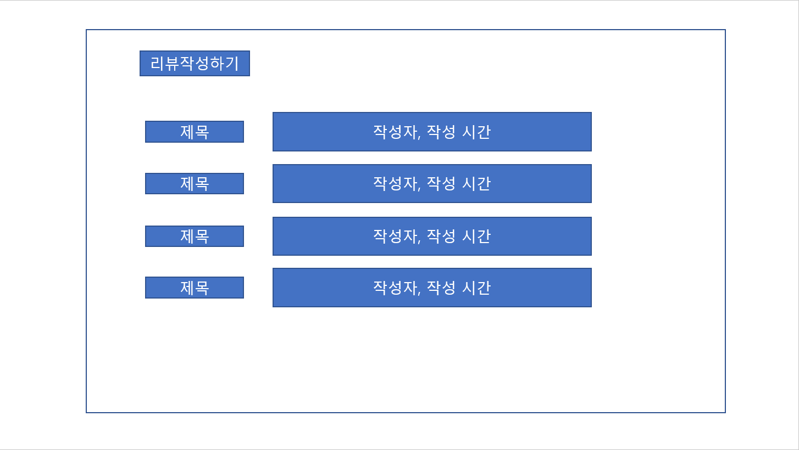
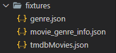

# Movie_Web_Application

# `05.17`

### 4조 : 김재우, 이광교

- 아직 명세가 나오진 않았지만 어떤 framework를 사용할 것인지와 역할 분배에 대해 이야기했다.

#### :melon: Framework : Django, Vue

#### :grapes: 역할 분배 : Front와 Back을 따로 나누지 않고 함께 !

- accounts와 movies를 나눠서 구현하면서 피드백하고 구현 후 서로 설명해주고 디버깅 하기 !
- 처음에는 좀 더 시간이 걸릴 수 있지만 완벽히 `Server`를 구현한 후 `Client`를 구현하면서 후반에 시간을 단축시킨다 !
- 추가적인 기능 생각해보기 !

<br>

#### :orange: 오늘 한 것 !

1. **Framework 정하기**

2. **Front와 Back에 관련하여 역할 정하기**

3. **Django를 사용하여 community json으로 출력해보기 → 출력 실패,,**
   - 생각보다 Django를 많이 잊어버려서 공부가 필요하다는 것을 느꼈다. 
   - html 파일이 아닌 json 파일로 출력해야하기 때문에 `serializers`에 대한 공부 필요 !!

<br>

<br>

# `05.18`

### 1. Gitlab 협업

- Server와 Client 두 개의 프로젝트를 만들어서 구현하기로 했다.
- 아직 명세가 나오지 않았기 때문에 기본적인 틀만 만들고 고의적으로 Conflict를 만들어보는 경험을 했다.

#### :bomb: Conflict 만드는 방법

- 각자 master의 branch를 만든다.

- 같은 부분을 수정하고 push한다.

- A와 B branch에서 각각 a와 b를 수정을 했다고 하면 A와 master가 merge할 때는 충돌이 나지 않지만 이렇게 merge한 것을 pull 받아서 B와 merge를 하게 되면 충돌이 일어난다.

- 아래의 에러메세지가 나온다.

  

  → 같은 부분을 수정했기 때문에 둘 중 어떤 것을 사용할지 정해야 한다.

#### :bulb: 해결 방법 1(Gitlab merge)

- Gitlab에서 merge를 하게 된다면 a와 b 둘 중 하나를 선택해서 merge할 수 있다.
- merge한 후 뜬 오류에서 옆에 보면 내용을 확인하고 바꿀 수 있는 부분이 있다.

#### :bulb: 해결 방법 2(Local merge)

- 로컬에서 merge 하는 방법으로 이 방법을 사용하면 a, b 둘 중 하나만 선택할 수도 있고 a, b 둘 다 선택할 수 있다 !  → 만약에 둘 다 merge 되는 것을 원한다면 로컬에서 merge !!

- 순서

  ```shell
  # testA branch 생성
  $ git branch testA
  
  # 해당 branch로 이동
  $ git switch testA
  
  # 수정하고 add, commit
  # push 할 때는 해당하는 곳에 push
  $ git push origin testA
  
  # merge할 때는 master branch에서!!
  $ git merge testA
  # -> 충돌이 일어나서 그 부분을 보여줌 -> 두 개를 다 선택하려면 both ~ 선택 !
  
  # merge 성공 ! 다시 git, commit, push
  # 로컬 branch 삭제
  $ git branch -d testA
  # 로컬에서만 삭제된 것이므로 Gitlab에서도 삭제를 해줘야한다.
  ```

#### :bulb: 해결한 후 branch 삭제 !

- branch 삭제는 동기화가 되지 않기 때문에 각각의 위치에서 삭제해줘야한다. Local에서 merge하고 branch를 삭제했다면 Gitlab에서도 branch를 따로 삭제해줘야한다. 반대의 경우도 마찬가지로 로컬과 Gitlab에서 각각 삭제해줘야한다.

<br>

#### :orange: 오늘 한 것

1. **`프로젝트를 시작하기 전에 미리 Conflict를 경험`하였다. 어느정도 진행 후에 에러를 보게 되는 것보다는 미리 경험하고 시작하자는 생각이었는데 좋은 선택이었던 것 같다.**

2. **명세가 나오지 않아서 구체적으로는 힘들지만 어느정도 예상되는 부분이 있기 때문에 각자 UI를 생각해서 수요일 오후 4시에 보기로 했다 !**

<br>

#### :watermelon: 해야할 것

- **각자 UI 생각해오기 !**

<br>

<br>

# `05.19`

### 1. UI 구성

#### :bulb: 광교

- 그림으로 표현해보았다 !

  |  |  |
  | ----------------------------------------- | ----------------------------------------- |
  |  |  |

- 메인페이지를 Carousel과 Progress, Card를 통해서 표현해보았다.

- Top10을 Carousel로 표현하였다. (관객수 기준)

- Progress는 재미요소를 넣은 추천 시스템이다. 주식차트, 코인차트와 같이 영화 리스트에서 랜덤으로 뽑은 20개를 관객수를 그래프량으로 나타내고 그것을 다시 랜덤으로 줄 세우는 것이다. 해당 영화의 제목은 볼 수 없고 단순히 `차트만`보고 선택하여 영화의 디테일한 정보를 얻게 된다. 

- Cart는 영화 리스트에 있는 목록을 출력한다.

- 2번째에 있는 그림은 영화의 정보를 나타내는 부분이다. 제목, 장르, 개봉일, 댓글, 평점(가능하다면 별 개수까지?)을 보여주고 추천 음식을 클릭하면 3번째 그림과 같이 나오게 된다.

- 첫번째 그림 상단에 있는 오늘 뭐먹지도 3번째 그림과 같은 정보를 출력하는 것을 생각했다.

#### :bulb: 재우

- ppt를 만들어오셨다.. 그림으로 그려온게 죄송해지는,,, 죄송합니다ㅠㅠㅠ
- 중략

#### 종합

- 로그인과 회원가입, 프로필 부분은 내가 구성해오지 않았던 부분이었고 재우님이 만들어오신 UI가 심플하면서도 명확해서 선택하여 사용할 것 같다. ___Simple is the best___
- 메인페이지 부분은 재우님이 만들어오신 부분과 비슷하게 갈 거 같다. 현재 많은 사람들이 사용하는 Netfilx와 왓챠, wavve 등의 UI와 비슷한 형식으로 만들어졌고 내가 그려온 것이 포함되어 있는 UI였다. 그리고 메인페이지에 랜덤 추천 이라는 버튼이 있었기 때문에 내가 그려온 UI가 그 안에 들어가는 것이 맞는 것 같다.
- Card를 눌렀을 때 나오는 부분은 아직 명확하게 정해지지는 않았지만 포스터를 넣느냐와 영상을 넣느냐, 리뷰의 위치 등을 좀 더 상의해봐야할 것 같다. 영상을 가져오는 것을 생각했지만 전체적인 UI를 그려보면서 '시간적인 여유가 있을까' 하는 고민이 생겨서 진행과정을 보면서 수정할 것 같다.
- 내가 그려온 부분은 전체적인 UI보다는 추가 기능(추천) UI에 가까웠던 것 같다😂 로그인과 회원가입, 프로필과 같은 부분은 따로 그리지 않고 추가 기능위주로 생각해서 만들어온 UI였기 때문에 차이가 있었던 것 같다. 전체적으로 사용하는 데이터가 비슷했기 때문에 좀 더 포괄적인 UI를 선택했고 심플하면서 직관적으로 보이게 할 예정이다. 추가 기능 UI는 시간을 보면서 추가할 예정이다.

<br>

### 2. ERD 구성

- 아직 명세가 나오지 않았지만 전체적인 ERD를 생각해보았다.

  

- User와 Review, Review와 Comment(만들게 된다면)는 1: N 관계로 진행할 것이고 User와 follow는 M : N 관계로 할 것이다.(프로필을 만들 것이기 때문에)
- 둘 다 고민을 한 부분이 찜하기 부분이었는데 Movie Data를 Django DB에 받아와서 할 것인지, Local에 저장할 것인지에 대한 고민이었다.
- 이 부분은 M : N 관계에 대해서 헷갈려서 재우님한테 많이 물어봤다.(재우님👍) 'user를 ManyToManyField로 Movie에 넣게 된다면 Movie 데이터를 받아올 때 user도 있어야하지않나' 라는 고민을 했고 재우님의 말과 이전 내용들을 보니 ManyToManyField를 사용할 경우에는 같이 넣어줄 필요가 없다는 것을 알게 됐다.(공부하자..😱)
- Local로 찜하기를 구현하게 되면 더 쉬울 것 같지만 배포를 생각한다면 DB에 데이터가 있는 것이 맞기 때문에 고민했고, DB로 한다면 M : N으로 하는 것이 맞는지를 고민했다. 이 후 정리된 생각을 마침 들어와있었던 다른 조에게 물어보았고 M : N 관계로 가능할 것 같아서 선택했다 ! 대전 1반 최고🙌

<br>

### 3. TMDB DATA 받기

- DB로 구현하기로 했기 때문에 data를 잘 받아올 수 있는지 테스트 해보았다. POSTMAN을 이용했고 TMDB의 api_key를 이용해서 받아왔다. popular 데이터를 보니 약 30개 정도로 돼보였는데 더 많은 데이터를 가져오는 url를 발견하지 못했다. 아마도 내일 알려주지 않을까? 싶다.
- 

#### **오늘은 여기까지 !** 내일부터 본격적인 시작 화이팅~~!

<br>

#### :orange: 오늘 한 것

1. **UI 구성 토의**
2. **찜하기 구현 DB / Local 선택 → `DB`**
3. **Postman 이용해서 TMDB Data 받아오기**

<br>

#### :watermelon: 해야할 것

- **serializers 공부 !**
- **1:N, M:N 이해**
- **내일을 위한 휴식 !!!**

<br>

<br>

# `05.20` 

# :star: 프로젝트 시작 :star:

### :bulb: 작성 Tip !

1. 프로젝트가 어떤 모습일지 그림 그리기
   - 종이나 프로그램(ex. figma) 상관 없이 그려보는 것이 중요!
2. 그림을 보고 어떤 기능이 필요할지를 글로 정리
   - 특히 서버랑 프론트랑 통신이 필요한 기능이라면 꼭 정리
3. 프론트는 컴포넌트 구조 짜기 
   - 예를들어 page가 5개 필요하다 그러면, 라우터를 붙이고, 해당하는 빈 컴포넌트를 만들고 하는 형태로..
4. 백엔드는 데이터 모델링 하기
   - 예를들어 todo 모델링을 한다면 어떤 필드가 있어야하는지, user모델이랑 관계는 어떻게 되는지 등등..
5. 프론트, 백엔드 둘 다 2번에서 정리한 글을 바탕으로 개발을 시작 !

<br>

### :melon: 시작 전 사용프로그램 정리

1. **GitLab**
   - 각자의 작업을 하고 파일을 합치는 과정을 담당, branch를 사용하여 자신의 부분을 작업한다.
2. **Notion**
   - 필요한 내용을 기록, 일정 공유, 토의 내용, 몰랐던 부분 등을 기록해간다.
3. **Mettermost**
   - 메세지나 간단한 파일들을 공유한다.
4. **Django**
   - 이용하여 Back-end(server)를 개발한다.
5. **Vue.js**
   - 이용하여 Front-end(client)를 개발한다.

<br>

### 1. UI 작성

- UI를 그리는 작업은 미리그려본 UI를 사용했다. 명세를 보면서 꼭 필요한 기능을 먼저 구현하기로 했고 이 후에 추가적인 기능을 붙이기로 했다. 

|  |  |
| ------------------------------------------------------------ | ------------------------------------------------------------ |
|  |  |
|  |  |
|  |  |

- 처음에 작성한 부분에서 토의를 통해 약간 수정된 부분도 반영하였다.
- Tip 2번의 글처럼 먼저 API를 통해서 가져와야 하는 부분들을 검은색 창으로 적어두었다.

<br>

### 2. ERD 구성


- user와 review 1:N,  review와 comment 1:N 관계를 설정했다.
- user와 movie는 M:N 관계를 설정했고 중간에 찜하기를 하기 위한 movie_like를 넣었는데 이부분은 확실하지 않아서 바뀔 수도 있을 것 같다.
- user, review, comment의 column은 대략적으로 작성했고 추후에 필요한 column이 있으면 추가, 삭제할 예정이다.
- movie와 genre부분의 column은 받아오는 movie.json에 기반하여 작성되었다. 

<br>

### 3. movie data 받아오기

- 이 부분은 가지고 있는 movies.json 파일을 이용했다. 100개의 데이터가 있기 때문에 기준 조건은 만족했고 loaddata를 통해서 받아올 수 있었다.

  :open_file_folder: 파일을 받아오기 위해서는 `fixtures`라는 폴더 안에 movies.json을 넣어주어야한다 !

- 가져오기는 했지만 이후의 작업을 생각한다면 API를 통해서 가져온 후 json으로 변환하여 사용해야될 것 같다. 

→ 팀원과 상의하면서 진행할 예정, 먼저 빠르게 필수적인 기능을 구현하고 바꿀 것 같다.

<br>

### 4. Account 구현

- 재우님이 맡아서 진행하셨고 api token을 받아오는 것과 signup 하는 부분을 구현하셨다.
- 구현 후 같이 돌아가는 것을 확인하고 코드를 살펴보는 시간을 가졌다.

<br>

### 5. Community 구현

- 내가 맡아서 진행한 부분으로 serializers를 사용하여 데이터를 json으로 넘겨주는 것에 집중했다. ERD가 작성되어있었기 때문에 관계설정과 column을 정하는 것이 빠르게 해결됐다.

- review 부분을 구현하면서 movie에 관한 review를 가져오려면 1:N 참조가 필요하다고 생각되었고 ERD에 추가했다. 또한 작성하면서 comment에 content가 빠진 것을 추가했다.

- 작성을 하다보니 url이 겹치는 문제가 발생했고 `Restful API`를 생각해야 된다고 느꼈다.

- review의 view를 작성하면서 movie의 참조에 대해서 좀 더 고민했고 리뷰 게시판을 따로 만들 것인지에 대해 토의해 보았다.

  ##### 😮 토의 내용

  - 리뷰 리스트를 만들지?
    - 만들게 되면 홈페이지에서 리뷰들이 전부 작성 되어있는 url로 이동하는 것이다.
    - 만들지 않게 된다면 리뷰를 보려면 해당 영화의 Card에서만 볼 수 있다. 
      - 이 경우에는 선택지가 2가지가 있는데 리뷰 작성하기를 해당 영화의 Card 안에서만 가능한 것과 밖에서도 작성하기 칸은 만들어 두는 것
  - 만들게 된다면 MovieSerializer가 있으면 좋지 않을까?(id와 title만 들어있는) -> 어떤 것에 대한 리뷰인지 알려주기 위해

  - 리뷰를 작성할 때 영화를 선택해서 작성하게 할 것인가. 이렇게 하면 save()
  - 아니면 리뷰 작성하기로 들어갈 때 영화데이터를 넘겨줘서 이 부분은 작성안해도 이전에 페이지에 있던 영화가 설정되도록 할 것인가. 이렇게 하면 save(movie=movie.id)

  ##### :question: 궁금한 점

  - 만약에 ReviewSerializer에 있는 movie를 가져왔을 때 id값만 가져오는데 여기서 id값에 해당하는 title을 가져올 수 있는지 ? →이게  된다면 굳이 MovieSerializer가 필요없음!

#### :heavy_check_mark: 막혔던 부분 !

- Django filter 사용 방법

  - [django filter](https://docs.djangoproject.com/en/3.2/topics/db/queries/#retrieving-specific-objects-with-filters)

  ```python
  @api_view(['GET'])
  def review_list(request):
      reviews = get_list_or_404(Review)
      serializer = ReviewListSerializer(reviews, many=True)
      return Response(serializer.data)
  
  
  @api_view(['GET'])
  def moviereview_list(request, movie_pk):
      reviews = Review.objects.filter(movie=movie_pk)
  		# filter를 사용했을 때 한개만 가져올지 전부를 가져올지, 이렇게 써도 되는지
  		# -> filter를 사용했을 때 list에서 movie_pk인 것을 전부 가져온다.
      serializer = ReviewListSerializer(reviews, many=True)
      return Response(serializer.data)
  ```

<br>

### 6. Postman 이용해서 Test

- 아직 Front 부분이 만들어지지 않았기 때문에 각자 맡았던 부분을 Postman을 통해서 정상적으로 돌아가는지 확인했다.

  :heavy_check_mark: data를 넣어줄 때는 form-data로 ! !

- 아직 로그인한 user를 가져올 수 없기 때문에 직접 넣어주어야하는 상황이 발생했고 read_only_filed에 있는 유저를 다시 field로 넣어서 해결했다.

  :heavy_check_mark: read_only_filed에 user가 있으면 user를 넣어서 요청 시 오류가 발생한다!

- 만들어진 12개의 url을 테스트했고 성공했다 :happy:

  - **accounts :** signup, getToken
  - **review :** create, detail, update, delete, all_list, movie_list
  - **community :** create, update, delete, list

<br>

#### :orange: 오늘 한 것

1. **UI 수정**
2. **ERD 작성**
3. **movies.json 받아오기**
4. **Accounts - Signup, api-Token**
5. **Community - Review, comment**
6. **Postman으로 정상 동작 확인**

<br>

#### :watermelon: 내일 할 일

1. **Login - vue**
2. **Logout -vue**
3. **사용자 인증(jwt)**
4. **Movie Home css**

<br>

#### :apple: 느낀 점

- 처음하는 프로젝트여서 생각이 많았던 것 같다. 그동안 공부했던 것을 활용하여 하는 프로젝티인 만큼 기본 기능을 완성하고 추가적으로 여러가지 해보고 싶다는 생각을 많이 한 것 같다. 물론! 내가 열심히 해야겠지만😅
- 팀원과 함께 진행한다는 것이 든든했다. 모르는 부분을 물어볼 수 있고 내 눈에 보이지 않는 오타나 에러를 찾아주면서 디버깅도 빠르게 진행됐다👍 둘 다 모르는 부분은 서로 찾아보면서 해결할 수 있다는 점까지 팀 프로젝트의 장점을 느낄 수 있었다 !
- 아직 많은 지식이 없다보니 내가 구현할 수 있는지, 내 방법이 맞는지 등에 대한 확신이 없다. 정해진 시간 안에 각자의 역할을 진행하다보니 일단 완성 후 도전하기로 했다. 빠르게 완성하고 얼른 추가적인 기능을 구현하고 싶다😀😀 많이 만져볼수록 배울 수 있으니까!

- 내일도 열심히 해서 목표한 일보다 빠르게(+정확하게) 진행해보자 !!

<br>

<br>

# `05.21`

## 오늘 목표

#### 1. Login.vue

#### 2. Logout.vue

#### 3. 사용자 권한 인증

#### 4. MovieList.vue

#### 5. MovieCards.vue

<br>

### 1. Login, Logout, 사용자 권한 인증

- 재우님이 맡아서 구현했다.

<br>

### 2. MovieList.vue

- 기본적으로 데이터를 받아오는 것은 성공했지만 Carousel을 넣는 것은 실패했다..

- 우리가 원하는 Carousel은 5개 정도의 영화 포스터가 보이가 좌우로 움직이면 한칸씩 이동하는 식이었는데 하나의 포스터에서만 움직일 수 있었다. 오래걸릴 것 같았기 때문에 일단 기본 데이터들만 받기로 하고 css는 마지막에 하기로 했다.(다음주의 우리에게 Toss--!)

  ##### 😮 토의 내용

  - 5개 정도가 보여지는 Carousel로 영화를 받으려고 했지만 쉽지 않다.
  - 일단 데이터만 받아놓고 마지막에 css를 몰아서 하는 것이 어떤지?

  → 필요한 데이터를 받아 놓는 작업만 하고 기본 구조 완성 후, 추가하는 방식으로

- 받아와야 하는 데이터

  - 가운데에 있는 영화 포스터 → Random
  - 최신 영화 → 개봉일 기준 10개
  - 위시 리스트 → 나중에 찜하기를 구현하고 !
  - 전체 영화 → list 전부를 받아온다.

- 결과

  

<br>

### 3. Review

- Accounts 부분이 빨리 끝나서 Movie를 같이 하려고 했지만 그것 보다는 Review와 Movie를 나눠서 진행하는 것이 좋다고 생각되어 각각 맡아서 진행했다.

- MovieList 부분을 끝내고 MovieDetail 부분을 할 예정이었으나 Review에서 Data를 넘겨줄 때 user_id 값을 어떻게 넘겨줄지에 대한 문제가 발생해서 같이 해결해보았다.

  ##### 😮 토의 내용

  - review를 작성하는데 user와 movie data가 필요하다. 이 때 user의 정보를 넘겨주려고 하는데 정보를 가져올 수 없는 문제 발생

  :bulb: 해결 아이디어

  1. user가 로그인 할 때 console.log(response)를 해보면 `{"username": "username", "password": "password"}` 부분이 있다. 여기서 username을 가져오고 이 user와 맞는 user_id 값을 django에서 받아오고 그 id값을 다시 넣어준다.

     → 이렇게 복잡하지는 않을 것 같지만 이 방법도 가능하지 않을까?

  2. user를 ForeignKey로 참조할때 user_id가 아닌 username field를 FK로 사용하면 가능하지 않을까?

     - 결과

       `unique=True`와 `to_field="username"`을 ForeginKey에 적어줬지만 review 작성에 user는 필수 항목 입니다 or User의 instance여야 한다는 에러 발생

       primary_key=True를 넣어 줘야 한다는 것 같은데 User의 username에 넣어야하는 것 같다. 이를 위해서는 AbstractUser를 보고 커스텀이 필요할 것으로 보인다.(아마두?🙄)

  :heavy_check_mark: 해결 했던 방법

  - jwt 토큰 안에는 유저 정보가 들어가 있다. 이 정보를 headers에 넘겨주면 request안에 들어가 있고 이를 통해 user_id 값을 넣어준다.

  - 아래에 보면 request.data에는 user의 정보가 없다 때문에 serializers에는 read_only_field에 user를 넣어주고 인증을 통과하게 한 후 request.user에 있는 user 정보를 넣어준다.

    - django

    ```python
    @api_view(['POST'])
    @authentication_classes([JSONWebTokenAuthentication])
    @permission_classes([IsAuthenticated])
    def review_create(request):
        serializer = ReviewSerializer(data=request.data)
        if serializer.is_valid(raise_exception=True):
            serializer.save(user=request.user)
            return Response(serializer.data, status=status.HTTP_201_CREATED)
    ```

    - vue

    ```vue
    methods: {
        setToken: function () {
          const token = localStorage.getItem('jwt')
          const config = {
            Authorization: `JWT ${token}`
          }
          return config
        },
        createReview: function () {
          const reviewItem = {
            title: this.title,
            content: this.content,
            rank: this.rank,
            movie: this.movie,
          }
    
          if (reviewItem.title) {
            axios({
              method: 'POST',
              url: 'http://127.0.0.1:8000/community/review/create/',
              data: reviewItem,
              headers: this.setToken()
            })
              .then((res) => {
                console.log(res)
                this.$router.push({ name: 'Review' })
              })
              .catch((err) => {
                console.log(err)
              })
            }
        },
        
      }
    }
    ```

<br>

### :weary: 에러 발생

- 무슨 이유 때문인지 모르겠다. 그나마 추측하는 거로는 master에서 한 작업이 있어서 gitlab에 올리지 않고 폴더 전체를 삭제하고 받았다는 것..?

- 이전에도 이러한 작업을 했는데 갑자기 오늘 에러가 발생했다.

  - 에러 내용

    ```shell
    App running at:
      - Local:   http://localhost:8080/
      - Network: http://192.168.0.26:8080/
    
      Note that the development build is not optimized.
      To create a production build, run npm run build.
    
    C:\Users\LEEKWANGGYO\Desktop\final_client\client\node_modules\watchpack\lib\chokidar.js:17
    throw new Error(
    ^
    
    Error: No version of chokidar is available. Tried chokidar@2 and chokidar@3.
    You could try to manually install any chokidar version.
    chokidar@3: Error: Cannot find module 'chokidar'
    Require stack:
    ...
    ```

- 어떤 모듈들이 없어서 안된다는 것 같은데 다행히 재우님이 찾아주신 방법으로 해결이 되었다!! 감사합니다​​🙌

  :heavy_check_mark: 아래의 코드를 순서대로 작성하면 해결 !

  	1. npm i -g npm 
  	2. npm update 
  	3. npm cache verify 
  	4. npm i -D chokidar 
  	5. npm i

<br>

#### :orange: 오늘 한 일

1. **Login**
2. **Logout**
3. **사용자 권한 인증**
4. **MovieList**
5. **Review 조금**

<br>

#### :watermelon: 내일 할 일

1. **Review**
2. **MovieDetail**

<br>

#### :apple: 느낀 점

- 비몽사몽해서 오전에 집중을 잘 못한 것 같다. 죄송합니다:sob:
- 어제는 오전에 생각했던 부분을 다 구현하고 오후로 넘어가면서 편하게 할 수 있었는데 오늘은 오전에 Carousel에서 막히면서 시간의 압박을 느끼게 되었다. ​➕ 점심 먹기전에는 client가 run serve가 안되는 문제가 발생했다. 왜 그랬는지는 아직도 모르겠다..
- 계획을 약간 변경해가면서 시도했고 저녁에 추가적으로 구현한 시간이 있지만 나쁘지 않은 선택이었다. css 부분에서 찾아봐야할게 많아 보여서 한번에 하기로 했고 필요한 데이터를 받아오는 것에는 성공해서 다행이었다.
- 처음에 django에서 구현했던 model이나 serializer가 조금씩 추가되면서 시간이 더 걸리는 것 같다. 처음에 서버에서 완벽하게 하는게 좋지만 그런 큰 그림을 보는 것은 쉽지않은 것 같다.. 추가하면서라도 구현 되면 다행인걸로😂

- 오늘은 목표를 변경해서 진행했지만 내일 저녁에는 목표한만큼 할 수 있기를 !!

<br>

<br>

# `05.22`

## 오늘 목표

#### 1. Review.vue CRUD

#### 2. Carousel

#### 3. MovieDetail.vue

<br>

### 1. Review

- 재우님이 맡아서 구현하신 부분 !
- movie_id 값을 어떻게 가져올지 같이 고민했는데 다른 사람들과 이야기하면서 힌트를 얻을 수 있었다 !
- MovieList.vue에서 받아오던 MoviesData를 App.vue 에서 받아오면서 해결했다.

<br>

### 2. Carousel

- 어제에 이어서 Carousel을 도전했다.
- [CodePen](https://codepen.io/trending) 사이트에 있는 Carousel을 이용했고 jQuery를 사용하지 않는 코드를 찾아서 바꿔보았다.

- 코드를 약간 수정해서 넣었을 때 Carousel은 나왔지만 다른 영화 카드들이 보이지 않는 문제가 발생했다. 코드를 주석처리하면서 확인한 결과 MovieList.vue에서 created로 영화 정보를 받아서 가져오는 현상때문에 일어난 것을 확인할 수 있었다.
- 이를 해결하기 위해 MovieList가 아닌 App.vue에서 영화 데이터를 받아와서 사용하였고 문제가 해결됐다.
- 코드를 수정하면서 원하는 모양을 만들어갔고 라이브러리를 사용하지 않고 3D Carousel을 만들 수 있었다.

→ 공부를 해서 직접 만들어보는 좋을 것 같다 ! (3D Carousel 라이브러리 이용해서)

- 결과

  

<br>

### 3. MovieDetail

- 어제 Carousel과 오류에서 시간을 많이 쓰면서 진행하지 못했던 부분을 진행했다.
- 카드를 누르면 그 위에 작은 상자로 나오게 하는 `Modal`을 이용했고 MovieList의 Component로 만들었다.
- 만들면서 처음에 구성을 어떻게 하느냐에 따라서 Component가 될지 새로운 url이 될지 결정된다는 것을 알았다. 이것은 데이터를 받아오는 과정에도 영향을 끼치기 때문에 처음 구상이 중요!!

- Component였기 때문에 MovieList 데이터를 그대로 사용하면 되었고 Click 이벤트를 통해서 창이 열리도록 했다.

- Detail 내용 배치는 CSS를 하면서 하기로 했고 필요한 데이터를 나오게만 해놓았다.

<br>

#### :orange: 오늘 한 일

1. **Review**
2. **MovieList - Carousel**
3. **MovieDetail**

<br>

#### :watermelon: 내일 할 일

1. **Review R, U, D**
2. **MovieDetail Genre, Comment C, D**

<br>

#### :apple: 느낀 점

- 생각했던 부분이 구현이 안되면서 초조함을 많이 느낄 수 있었다. 얼마나 걸릴지 모른다는 시간의 압박..
- 대표적으로 Carousel을 기본 모델이 아니라 3D로 사용하려고 하니 어려움이 많았고 다른 사람의 코드를 약간 바꾸어서 사용하게 되었다.
- 아직 구현할 게 많아서 급하게 마무리를 짓고😥 다른 것을 하지만 이러한 부분을 직접 공부해서 만들 수 있으면 더 좋고 활용도 다양할 것이라고 생각됐다.
- 그래도 Carousel이 해결됐기 때문에 다음 과정을 편하게 진행할 수 있을 것 같고 주말안에 기본 기능을 완성할 수 있기를..!

<br>

<br>

# `05.23`

## 오늘 목표

#### 1. Review R, U, D 구현

#### 2. Comment C, D 구현

#### 3. 이전에 미흡했던 부분 수정

<br>

### 1. Review

- 작성에 이어서 Detail한 내용을 보여주는 것과 수정, 삭제를 구현하기로 했다.
- 재우님이 맡아서 진행했고 URL을 새로 만들어서 구현했다.

<br>

### 2. Comment

- 영화를 나타내는 부분의 기본적인 것들은 어느정도 했기 때문에 Review에 대한 댓글 작성, 삭제를 구현했다.
- 구현을 하기 전에 명세를 읽어보았는데 작성시각이 필요했고 Server model에 created_at과 updated_at을 추가했다.

- django를 통해서 많이 했었던 작업이라서 비교적 금방 끝낼 수 있었고 정상적으로 작동하는 것을 확인했다.

<br>

### 3. 미흡했던 부분 수정

- 전체적으로 돌아보면서 미흡한 부분을 서로 피드백해주었다.
- 기능들을 확인하면서 명세에 적혀있지만 안된 부분, 추가적으로 했으면 좋은 부분을 말하면서 수정할 부분을 기록했다.

- 대표적으로 작성자만 수정, 삭제 할 수 있는 것과 Comment 작성, 수정 시 바로 화면에 보이기, 리뷰 수정시 원래 글 가져오기 등이 있었다.

<br>

#### :orange: 오늘 한 일

1. **Review R, U, D**
2. **Comment C, D**
3. **미흡한 부분 기록**

<br>

#### :watermelon: 내일 할 일

1. **Review 수정 시 원래 글 가져오기**
2. **작성자만 수정, 삭제 가능**
3. **Comment 작성, 수정 시 바로 화면에 보이기**
4. **MyWishList 구현**

<br>

#### :apple: 느낀 점

- server와 client를 같이 하면서 생각처럼 안되는 부분들이 많았던 것 같다.
- 바로 반영되는 것이나 수정 전의 글을 불러오는 과정 등이 잘 안되었고 user의 정보를 어디서 가져오고, 어떻게 비교할지를 고민했다.
- 진행속도가 나쁘지 않았다고 생각했는데 에러 발생과 구현의 어려움이 조금씩 생기면서 시간이 없다는 것을 많이 느꼈고 이를 해결하기 위해서는 코드의 이해가 필요하다고 생각되었다.
- 재우님과 같이 코드 이해의 중요성에 대해 이야기하면서 모르는 부분이 쌓여서 더 힘들다는 것에 공감할 수 있었다,,
- 기본 기능을 완벽하게는 구현하지 못했고 수정해야할 것들을 기록하면서 내일 완성하기로 했다. 아직 CSS도 해야하기 때문에 더 열심히 해야할 것 같다 !

<br>

<br>

# `05.24`

## 오늘 목표

#### 1. Review 수정 시 원래 글 가져오기

#### 2. 작성자만 수정, 삭제 가능

#### 3. 작성, 삭제시 바로 화면에 보이기

#### 4. MyWishList 구현

<br>

### 1. Review 수정 시 원래 글 가져오기

- 재우님이 구현하신 부분이다.
- 새로운 URL로 수정 페이지를 만들었고 앞의 데이터를 받아와서 placeholder로 넣어 주었다.

<br>

### 2. 작성자만 수정, 삭제 가능

- Django로 했을 때는 간단했지만 Vue에서 하다보니 현재 로그인한 유저의 정보를 어디서 찾을지 고민이 되었다🙄
- 처음에는 server로 요청을 보내고 jwt의 user와 Review의 user를 다시 가져와서 비교해서 또 한번 server에 요청을 보내는 것이었는데 이론상 가능해 보였지만 비효율적일 것이라고 생각되었다.
- 때 마침 다른 조가 Modal에 대해 물어보려고 왔고 알려주면서 이 부분을 물어보았더니 `jwt Decoded`를 알려주었다. 이는 jwt를 해석해서 user_id, username, password를 볼 수 있었고 이것을 활용해서 user_id를 비교하는 방식으로 하기로 했다.
- [jwt decoded](https://github.com/auth0/jwt-decode)를 참고하여 npm 설치를 했고 jwt_decode로 값을 받아서 LocalStorage에 저장하여 비교하는 방식으로 해결할 수 있었다.

<br>

### 3. 작성, 삭제시 바로 화면에 보이기

- 새로운 함수(reloadPage)를 만들어서 해결했다.
- 작성, 삭제 요청에 대한 응답이 끝나는 시점에 페이지 새로고침 기능을 하는 reloadPage를 실행시켜서 바로 보여질 수 있도록 했다.
- 이 문제를 해결하면서 ReviewDetail 페이지에서 새로고침을 할 경우 데이터를 출력하지 못하는 문제를 발견했다.
- params를 통해서 데이터를 전달받기 때문에 새로고침을 하는 경우에는 전달받는 데이터가 없어서 나타나는 문제였다. 해결하기 위해 많은 시간을 썼지만 생각처럼 동작하지 않았고 내일 더 찾아보기로 했다.

<br>

### 4. MyWishList 구현

- 찜하기(좋아요) 기능을 통해 로그인한 유저가 찜한 영화 리스트를 보여주는 부분을 구현했다.

- MovieDetail Modal에서 찜하기 버튼을 만들었고 Modal창을 띄울 때 찜하기 데이터를 추가해서 보내주었다. 데이터를 넘겨주지 않았을 경우 하나의 영화에서 찜하기를 했을 때 나머지 영화들의 찜하기 버튼(❤)도 바뀌어 있는 것을 볼 수 있었다.(DB변화가 아닌 아이콘 변화)

- 찜하기를 하고 모달 창을 닫으면 바로 MyWishList에 들어가게 하기 위해 닫았을 경우 reloadPage 함수를 실행시켰다. → 새로고침을 하는 것처럼 나타나게 된다, 닫기 버튼이 아닌 화면 밖을 클릭하면 MyWishList에 바로 보이지 않는다.(DB는 바꼈지만 데이터를 받아오지 못해서)

- 좋아요를 하면 alert를 통해 찜하기를 했는지, 취소했는지를 출력해주었고 `Font Awesome`의 아이콘을 사용했다.

  ```html
  <link rel="stylesheet" href="https://use.fontawesome.com/releases/v5.15.3/css/all.css" integrity="sha384-SZXxX4whJ79/gErwcOYf+zWLeJdY/qpuqC4cAa9rOGUstPomtqpuNWT9wdPEn2fk" crossorigin="anonymous">
  
  <button @click="likeClick" class="like-btn">
                      <i v-if="likeMessage === '좋아요 취소'" class="btn like-icon fas fa-heart like-icon" style='color:red' title="찜하기"></i>
                      <i v-else class="btn like-icon far fa-heart like-icon" style='color:red' title="찜하기"></i>
                    </button>

<br>

#### :orange: 오늘 한 일

1. **Review 수정 시 원래 글 가져오기**
2. **작성자만 수정, 삭제 가능**
3. **작성, 삭제시 바로 화면에 보이기**
4. **MyWishList 구현**

<br>

#### :watermelon: 내일 할 일

1. **Account Styling**
2. **Community Styling**
3. **Movie Styling**

<br>

#### :apple: 느낀 점

- 같은 기능을 구현할 때 Django와 Vue에 따라서 구현 방식이 다른 것을 알게 되었다. user_id를 Vue로 비교하는 부분이  아이디어가 떠오르지 않아서 당황했고 방법을 알게 된 후에는 쉽게 구현할 수 있었다. 이러한 경험이 비슷한 기능을 구현할 때 도움이 될 것 같다🙂
- 생각하지 못했던 새로고침 문제에서 시간을 많이 사용했다. Vuex를 사용해서 한 곳에서 데이터를 뿌려주면 좋을 것 같은데 이미 Vue로 만들었기 때문에 새로운 방법을 찾아야했다. 그 방법으로 created에 데이터를 받아오는 함수를 넣어주어서 페이지가 새로고침 할 때마다 다시 데이터를 받아오는 방식을 선택했다. 데이터 양이 많아지면 비효율적일 것 같지만 지금의 데이터 양은 속도의 큰 차이 없이 돌아갔다. 이래서 복잡해지면 Vuex를 사용하는 이유 중 하나인가..?🙄
- 기본 기능을 빠르게 구현하고 나머지 시간을 효율적으로 활용하려고 했지만 문제를 발견하고 해결하는 과정에 많은 시간을 쓰는 경우가 많았다. 이러한 문제를 해결하기 위해 코드에 대한 정확한 이해가 필요하다는 것과 처음 구조를 선택할 때 많은 것을 생각하면서 짜야한다고 느꼈다.
- 해결되지 않은 문제들과 새롭게 발견된 에러를 잘 해결하고 시간내에 완성해보는 것이 1차 목표이고 처음에 생각했던 그래프를 통한 랜덤 추천을 구현해 볼 예정 !

<br>

<br>

# `05.25`

## 오늘 목표

#### 1. Account Styling

#### 2. Community Styling

#### 3. Movie Styling

#### 4. 추천 알고리즘 구현

<br>

### 1. Account Styling

- 재우님이 맡아서 구현하신 부분이다.

- 로그인과 회원가입에 선을 그어서 표시해주었고 버튼은 transition과 hover를 통해 색이 움직이는 효과를 주었다.

  | Login                                                        | SignUp                                                       |
  | ------------------------------------------------------------ | ------------------------------------------------------------ |
  |  |  |

  ```css
  .idForm{
    border-bottom: 2px solid #adadad;
    margin: 30px;
    padding: 10px 10px;
  }
  
  .id {
    width: 100%;
    border:none;
    outline:none;
    color: #636e72;
    font-size:16px;
    height:25px;
    background: none;
  }
  
  .btnbutton {
    position:relative;
    left:40%;
    transform: translateX(-50%);
    margin-bottom: 40px;
    width:80%;
    height:40px;
    background: linear-gradient(125deg,#81ecec,#6c5ce7,#81ecec);
    background-position: left;
    background-size: 200%;
    color:white;
    font-weight: bold;
    border:none;
    cursor:pointer;
    transition: 0.4s;
    display:inline;
  }
  
  .btnbutton:hover {
    background-position: right;
  }
  ```

- 추가적으로 로그인을 하면 상단에 username 나오는 것을 추가했다.(로그아웃 왼쪽)

<br>

### 2. Community Styling

- 재우님이 맡아서 구현하셨다.
- 후에 피드백을 받으면서 버튼의 위치와 시간, 통일성 등을 같이 고쳐나갔다.(수정 전 사진이 없다😢)

<br>

### 3. Movie Styling

- 내가 맡아서 구현한 부분 !!

- 먼저 MovieList의 Carousel과 Card의 radius, 크기 등을 수정했다.

- 배치가 생각처럼 되지 않아서 시간이 걸렸다. 크기와 margin을 조정하면서 배치했고 hover를 이용해서 커서를 올렸을 때 크기가 약간 줄어드는 효과와 box-shadow로 그림자 효과를 넣어보았다.

- MovieDetail의 Modal 부분은 크기를 px로 지정해서 만들었다. 여기서 점점 모양이 망가지고 배치가 꼬이는 문제가 발생했다. 영화마다 글자의 위치와 여백이 달라져서 멘붕,,😨

- 생각처럼 배치게 되지 않아서 시간이 조금  걸리지만 검사창을 통해 하나하나 해결해갔다. 하나씩 해결하다보니 Container 설정과 d-flex의 관계를 이해하게 되었고 순차적으로 맞춰나갈 수 있었다!

- 이 부분 역시 후에 피드백을 받으면서 카드의 통일성 있는 배치와 이미지 크기 등을  조절했다.(수정 전 사진이 없다😢)

  - MovieList card 부분

  ```css
  .cards-list {
    z-index: 0;
    width: 100%;
    display: flex;
    justify-content: start;
    /* flex-wrap: wrap; */
    flex-direction: row;
  }
  
  .card {
    margin: 22px;
    width: 200px;
    height: 300px;
    border-radius: 10px;
    box-shadow: 5px 5px 30px 7px rgba(0,0,0,0.25), -5px -5px 30px 7px rgba(0,0,0,0.22);
    cursor: pointer;
    transition: 0.4s;
    border: 0;
    display: flex;
    padding: 0;
  }
  
  .card .card_image {
    width: 300;
    height: 300;
    border-radius: 10px;
  }
  
  .card .card_image > a img {
    width: 300;
    height: 300;
    border-radius: 10px;
    object-fit: cover;
  }
  
  .card:hover {
    transform: scale(0.9, 0.9);
    box-shadow: 5px 5px 30px 15px rgba(0,0,0,0.25), 
      -5px -5px 30px 15px rgba(0,0,0,0.22);
  }
  ```
  - MovieDetail 글자 부분

  ```css
  .f { 
    font-family: 'Noto Sans KR', sans-serif;
  }
  
  .overview-limit {
    overflow: hidden; 
    text-overflow: ellipsis; 
    display: -webkit-box; 
    -webkit-line-clamp: 4; /* 라인수 */ 
    -webkit-box-orient: vertical; 
    word-wrap:break-word; 
    line-height: 1.2em; 
    height: 4.8em;
    margin-left: 1rem;
  }
  
  .review-limit {
    overflow: hidden; 
    text-overflow: ellipsis; 
    display: -webkit-box; 
    -webkit-line-clamp: 2; /* 라인수 */ 
    -webkit-box-orient: vertical; 
    word-wrap:break-word; 
  ```

  - MovieDetail modal부분

  ```css
  .modal-box {
    box-shadow: 10px 10px 5px rgb(87, 87, 104);
    background-color: rgb(171, 171, 189);
    width: 100%;
  }
  
  .modal-dialog-box {
    width: 70%;
    height: 70%;
    max-width: 100%;
    max-height: 100%;
  }
  
  .movie-detail-content{
    padding: 10px 40px;
  }
  
  .modal-second-box{
    padding: 20px;
  }
  ```

  - Recommend 부분

  ```css
  .box-size-for-img{
    width: 32%;
    height: 61%;
    margin-bottom: 50px;
    background-color: rgb(190, 214, 200);
  }
  
  .box-size{
    width: 61%;
    height: 61%;
    font-size: 20px;
    color: rgb(0, 0, 0);
    /* opacity: 0.7; */
    background-color: rgba(205, 190, 214, 0.5);
    border-radius: 15px;
  }
  
  .overview-limit2 {
    overflow: hidden; 
    text-overflow: ellipsis; 
    display: -webkit-box; 
    -webkit-line-clamp: 6; /* 라인수 */ 
    -webkit-box-orient: vertical; 
    word-wrap:break-word; 
    line-height: 1.8em; 
    height: 10.8em;
  }
  ```

<br>

### 4. 추천 알고리즘 구현​ :bulb:

- 처음에 생각했던 추천 방식을 구현해보고 싶어서 새벽에 시간을 더 투자해봤다.
- bootstrap의 progress를 활용하여 그래프를 세로로 만들고 안에 있는 %를 조정하여 주식이나 코인의 그래프와 같이 구현하는 것이 목표였다.
- 하지만 !!!!! 결론부터 말하자면 구현하지 못했다..😭😭 데이터를 받아오는 것은 쉽게 해결할 수 있었지만 그보다 먼저 style안의 width를 변수로 설정할 수 있는가에서 막히게 되었다. 구글링을 하면서 찾아봤는데 변수로 넣어주는 방법을 찾지 못했다..3시간동안 싸우다가 결국 놓아주기로 했고 아직 남아있는 문제를 해결하기로 했다.

<br>

#### :orange: 오늘 한 일

1. **Account Styling**
2. **Community Styling**
3. **Movie Styling**

<br>

#### :watermelon: 내일 할 일

1. **Review 새로고침 문제 해결**
2. **Modal to Review 문제 해결**
3. **MovieRecommand 새로고침 문제 해결**
4. **추가적인 스타일링**
5. **장르 한글로 가져오기**

<br>

#### :apple: 느낀 점

- CSS를 적용하면서 만질수록 고장나는 사진이 생각이 났다😖 내가 맡은 Movie에서 체험도 할 수 있었다. 전에 Web Portfolio는 간단한 CSS여서 그냥 넘겼지만 이번에는 좀 더 예쁘게 해보고 싶어서 여러가지 효과를 찾아보면서 넣어봤던 것 같다.
- Carousel 부분은 3D Carousel 라이브러리를 사용하지 않고 구글링을 통한 코드를 참고하여 바꿔서 구현했었는데 코드를 정확히 이해하지 못해서 일정 부분은 원하는 형태로 만들기 힘들었다. 추후에 시간을 투자해서 직접 만들어보면 좋은 공부가 될 것이라고 생각된다.
- 문제가 발생한 부분을 검사를 통해서 해결하면서 Container와 정렬에 대한 이해가 부족했다는 것을 느꼈고 고치면서 점점 생각대로 배치되는 모습을 확인할 수 있었다😊😊 고쳐져서 다행이다..ㅎㅎ
- 생각했던 그래프 추천 알고리즘을 구현하지 못해서 아쉬웠지만 아직 남아있는 문제를 해결하고 장르부분을 가져오는 과정을 다시 해보기로..!

<br>

<br>

# `05.26`

## 오늘 목표

#### 1. Review 새로고침 문제 해결

#### 2. MovieRecommand 새로고침 문제 해결

#### 3. Movie Modal to Review 문제 해결

#### 4. admin 만들기

#### 5. 추가적인 스타일링

#### 6. 부족한 부분 수정

#### 7. 장르로 추천 알고리즘 구현

<br>

### 1. Review 새로고침 문제 해결

- params로 데이터를 넘기는데 새로고침을 하면 넘어오는 데이터가 없기 때문에 글이 안뜨는 문제였다. 구조를 이미 설정했기 때문에 전체를 바꿀 수 없었고 이 안에서 해결해야했다.

- ReviewDetail과 UpdateReview 부분

- 재우님이 이 부분을 담당해서 해결하셨고 방법은 url에 데이터를 넣어주는 것이었다!

  - index.js의 path를 바꿔주고 props:true 옵션으로 데이터를 넘겨주는 방식

  ```javascript
  {
      path: '/community/review/detail/:review_id/movie/:movie_id', 
      name: 'ReviewDetail', 
      component: ReviewDetail,
      props:true,
    },
    {
      path: '/community/review/update/:review_id', 
      name: 'UpdateReview', 
      component: UpdateReview,
      props:true,
    },
  ```

- url로 데이터를 줬기 때문에 새로고침해도 데이터가 넘어왔고 글이 출력될 수 있었다.

<br>

### 2. MovieRecommand 새로고침 문제 해결

- 여기서도 새로고침할 경우 영화 데이터를 받아오지 못하는 문제가 발생했다.
- 해결하기 위해서 created에 getRecoMovieData라는 영화를 받아오는 함수를 넣어줬고 새로고침을 할 때마다 데이터를 받아오면서 해결할 수 있었다.
- 처음에는 문제를 발견하지 못했다가 새로고침을 하면 랜덤 영화가 다시 출력되지않을까 하면서 발견하게된 문제이다. 평소에 사용하는 브라우저를 보면 새로고침을 많이 했는데 이러한 부분을 생각해서 만들어야 겠다고 느꼈다.
- 문제 해결과 동시에 새로고침 버튼을 넣어줘서 다른 영화를 추천 받을 수 있게 해주었다!

<br>

### 3. Movie Modal to Review 문제 해결

- Modal에서 작성되어 있는 리뷰를 눌렀을 경우 해당 리뷰로 가지지만 데이터가 보이지 않는 문제였다.

- 이 문제는 Review 새로고침 문제를 해결하면서 데이터 넘겨주는 방식을 바꿔서 해결했다.

- 데이터를 params로 url에 넘겨주고 int를 string으로 바꿔져서 타입을 맞춰 주었다.

  ```javascript
  // 리뷰를 클릭하면 해당 리뷰로 이동
      reviewClick (selectMovieReview) {
        this.toReview = true
        if (this.toReview) {
        this.$router.push({ name: 'ReviewDetail', params: { review_id: String(selectMovieReview.id), movie_id: String(selectMovieReview.movie) }})
      }
  ```

<br>

### 4. admin 만들기

- Django에서 지원하는 기능을 통해 간단하게 만들 수 있었다.

  - Community

  ```python
  from django.contrib import admin
  from .models import Review, Comment
  
  # Register your models here.
  admin.site.register(Review)
  admin.site.register(Comment)
  ```

  - movies

  ```python
  from django.contrib import admin
  from .models import Genre, Movie
  
  # Register your models here.
  admin.site.register(Genre)
  admin.site.register(Movie)
  ```

<br>

### 5. 추가적인 Styling

- Font를 바꾸기 위해 [Google Fonts](https://fonts.google.com/)사이트를 이용했다.
- 전체에 적용하고 싶어서 index.html과 App.vue에서 바꾸어가며 넣어줬는데 적용이 되지 않았다. 적용된 다른 팀과 비교하면서 문제점을 찾으려고 했지만 같은 코드인데 적용되지 않았고 어디가 문제인지 찾을  수 없었다..
- 결국 글이 적힌 부분에 따로 Styling을 적용하여 바꿔주게 되었다. 어디가 문제인 건지..😞

<br>

### 6. 부족한 부분 수정

- 댓글 생성 / 수정 시각 받아오기
  - 게시글의 시각은 받아왔지만 댓글의  시각을 받아오지 않은 것을 발견했고 ERD와 Django의 model, serializer를 수정하면서 받아왔다.
- Axios 요청에서 .catch(응답 실패):frowning_face: 일 때 error를 alert를 출력해주었다. 좀 더 자세히 해주고 싶었지만 error가 어떤 식으로 구성되었는지 console.log로 보이지 않아서 error 자체를 alert로 나타내었다.

<br>

### 7. 장르로 추천 알고리즘 구현

- 결론부터 말하자면 구현하지 못했다.
- JavaScript로 구현하려했지만 비교하여 데이터를 가져오는 과정에서 for문을 2개를 써야하는데 이 부분이 구현되지 않았다..
- 초기에 구현하려다가 실패했고 다시 한번 해보려했지만 뜻대로 되지 않아서 아쉬웠다. 시간이 많지 않았기 때문에 일단 프로젝트 완성을 목표로 하기로 했다.

<br>

#### :orange: 오늘 한 일

1. **새로고침 문제 해결**
2. **admin 만들기**
3. **추가적인 Styling**
4. **부족한 부분 수정**

<br>

#### :watermelon: 내일 할 일

1. **전체적인 피드백 후 수정**
2. **영화 검색 자동완성**
3. **PPT 제작**
4. **README 작성(제출용)**

<br>

#### :apple: 느낀 점

- 새로고침 문제에 대해 고민하고 많은 시간을 투자했었는데 해결이 돼서 기뻤다. 이런 문제가 처음에 잡은 구조에서 나타난 것이라고 생각되었고 현업에서 Vuex를 사용하는 이유를 알 것 같았다.
- 같은 코드에서 Google Font가 적용되지 않는 이유를 알 수 없어서 답답했지만 개별로는 적용이 되어서 해결할 수 있었다. 팀마다 구조가 다르기 때문에 같은 코드여도 적용이 안될 수 있다는 것을 경험했고 처음에 큰 그림을 보면서 구조를 짜는 것:memo: 이 중요하다고 생각되었다.

- 장르를 기반으로 하는  추천은 기본으로 만들고 색다른 추천 알고리즘을 추가하려 했지만 전부 구현이 안되면서 너무 아쉬웠다😥 데이터의 형태에 따라 Django와 Vue 중 어디서 조작해야할 지 잘 판단해야할 것 같다.

<br>

<br>

# `05.27`

## 오늘 목표

#### 1. 피드백 반영하기

#### 2. 영화 title 자동 완성

#### 3. 기타 문제 해결

#### 4. PPT 제작

#### 5. README 작성

<br>

### 1. 피드백 반영하기

##### - 로그인, 회원가입

- [x] 로그인 화면 늘리기
- [x] 회원가입 화면 늘리기

| Login                                                        | SignUp                                                       |
| ------------------------------------------------------------ | ------------------------------------------------------------ |
|  |  |

##### - Review

- [x] 리뷰 작성 페이지 키우기
- [ ] 작성자, 제목, 작성시각
- [x] padding 추가, 흰색 영역 고정(ex.80%), min heigth 사용
- [x] 네이버 리뷰를 넣어서 어떻게 나오는지 체크
- [x] 내용칸 없애기 or 요약
- [x] 제목칸 크기가 크고 작성시간 칸을 작게
- [x] 버튼 줄이고 수정 버튼 색깔 바꾸기
- [x] 버튼 오른쪽 정렬
- [x] 자동완성 클릭하면 반영
- [x] 댓글 창 작성자 추가, 삭제버튼 줄이기


##### - 데이터

- [x] TMDB DATA로 바꾸기



##### - MovieList

- [x] Carousel 높이 키우기
  - [ ] 회전반경 늘리기
- [x] MyWishList 글자 보이기
  - [x] ex) 글자 영역에 그림자 → 글씨 잘보이게
  - [x] 카드 왼쪽으로 정렬
- [x] 배경화면 : 해상도 높은 사진으로, 하나의 그림으로?  → 보류
- [x] 폰트
  - [x] 태그 단위로 변형 시도
  - [x] ex) 고딕류의 폰트, 구글폰트 노트산스, font weight 조정


##### - MovieDetail

- [x] 모달창 그림자 색 연하게(흰색, 회색 계열?)
- [x] 모달 창 크기 키우기
- [ ] 찜하기 버튼 → 화면 중간에 떴다가 사라지게?


##### - Recommend

- [x] 포스트를 원본 비율로
- [x] 글이 잘 보이려면 뒤에 투명 영역이 있어야함
- [x] 제목 키우고 내용 크기는 그에 맞게


- 전체적인 피드백을 받았고 무조건 받아들이는 것이 아닌, 토의하며 선택적으로 받아들이면서 수정해갔다.
- 주로 통일감을 주고 색과 효과가 잘 보일 수 있도록 바꾸었다.
  - contaniner안의 div에 %로 크기값을 주고 min-height를 사용해서 크기를 조정했다.
  - 재우님과 함께 색을 비교하고 어울리는 색을 찾아갔다.
  - 카드의 배치를 수정했고 이미지를 원본 비율에 맞춰서 수정했다.
  - 리뷰와 댓글에 들어가는 내용과 버튼의 위치, 크기를 조정했다.

<br>

### 2. 영화 title 자동 완성

- 추가로 구현한 부분 중 하나이다.

- 재우님이 기초 틀을 잡고 이 후 불어오는 과정에서 같이 고민하여 영화를 선택시 그 이름이 자동으로 검색창으로 가도록 하였다.

  ```vue
  <template>
    <div>
      <i class="fas fa-search">
        <input :placeholder="this.skillInput" v-model="skillInput" @input="submitAutoComplete" 
        type="text" 
        style="margin-bottom : 15px;"
        @change="onChange" />
      </i>
      <div class="autocomplete disabled">
        <div
            style="cursor: pointer"
            v-for="(res,i) in result"
            :key="i"
            @click="onClickTitle(res)"
            >{{ res }}
        </div>
      </div>
    </div>
  </template>
  
  <script>
  import skills from "./skills.js";
  export default {
    data() {
      return {
        skillInput: null,
        result: null,
      };
    },
    methods: {
      onChange () {
        this.$emit('input-change', this.skillInput)
      },
      submitAutoComplete() {
        const autocomplete = document.querySelector(".autocomplete");
        if (this.skillInput) {
          autocomplete.classList.remove("disabled");
          this.result = skills.filter((skill) => {
            return skill.match(new RegExp("^" + this.skillInput, "i"));
          });
        } else {
          autocomplete.classList.add("disabled");
        }
      },
      onClickTitle (res) {
        console.log(res)
        this.skillInput = res
        this.onChange()
      }
    },
  }
  </script>
  
  <style>
  
  </style>
  ```

<br>

### 3. 기타 문제 해결

- Login창에서 새로고침 문제가 발생했는데 이 부분은 구조상 해결이 될 수 없었다ㅠㅠㅠ
  - Router를 통해서 해보고 created에 함수를 통해서 구현해봤지만 무한 루프에 빠지는 결과가 나타났다. App에서 수정을 하기 때문에 계속 같은 것이 반복되는 문제였다.

- Login 후 바로 username을 보이게 하고 싶었지만 이 부분 역시 새로고침이 필요했고 이후에 보이는 문제가 나타났다. 위의 문제와 마찬가지로 Login 후 새로고침이 안되었기 때문에 해결하지 못했다..😭

### 4. PPT 제작


**...**

<br>

### 5. README 작성


​	**...**

<br>

#### :orange: 오늘 한 일

1. **피드백 적용**
2. **영화 title 자동 완성**
3. **기타문제해결**
4. **PPT 제작**
5. **README 작성**

<br>

#### :watermelon: 내일 할 일

1. **발표 및 평가**

#### :apple: 느낀 점

- 피드백을 받고 많은 부분을 수정하기로 했다. 확실히 통일감이 있을 때 깔끔하게 보였고 이미지의 크기를 원본 비율과 맞추니까 어색했던 부분이 사라졌다.
- 피드백 받은 부분을 재우님과 상의하면서 받아들일 부분과 아닌 부분, 수정 가능과 불가능을 판단하면서 바꿔보았고 확실한 건 전보다 나아졌다는 것!!(다행이다:happy: )
- 영화 title 자동완성 알고리즘은 구글링을 통해 참고한 부분으로 스스로 구현할 수 있는 실력을 갖추는 것이 새로운 목표 중 하나!
- 기타 문제의 핵심은 새로고침인데 구조로 인해 연속적으로 나오는 에러라 너무  슬펐다. 갈아엎기에는 너무 멀리온 느낌,, 정말 많은 시간을 쏟은 곳이고 끝까지 해결하려 했지만 안돼서 아쉬웠다.

<br>

<br>

## 마무리

- 시원섭섭섭섭하다😀😂😭😅
- 처음으로 하는 협업 프로젝트여서 걱정과 기대를 가지고 시작했었다. 그동한 배운 것들을 최대한 활용하여 만들어보자는 생각으로 시작했고 Git을 통한 협업이 어떻게 이루어지는지 경험하고자 했다. 
- 🧹매도 먼저 맞는게 낫다고 시작하기전에 충돌을 미리 경험했고 :bulb: 각자의 아이디어를 공유해보며 협업이 이루어지는 과정을 배울 수 있었다. 에러가 해결이 안되고 피곤할 때도 있었지만 적절한 쉬는 시간과 개인적인 이야기를 나누면서 재미있게 진행했고 서로 도와주면서 협업의 장점을 느낄 수 있었다. 재우님 고생하셨습니다🙇‍♂️
- 프로젝트가 진행될수록 생각하지 못했던 에러가 발생했고 해결하면 새로운 에러, css를 할수록 망가지 문제 등 다양한 경험을 하다보니 시간이 정말 빠르게 흘러갔다.  잡았던 계획도 조금씩 밀리고 새롭게 추가, 수정하면서 정말 시간가는 줄 모르고 진행했던 것 같다.
- 부족했던 부분들을 많이 느낄 수 있었고 모르는 부분을 구글링을 통해 해결하는 방법을 배울 수 있었던 시간이었다. 문제를 마주했을 때 해결할 수 있다는 자신감을 얻었고 새로운 내용을 마주했을 때 배워나가는 자세를 기를 수 있는 좋은 경험이었다🙂 다음에는 좀 더 발전된 결과물을 만들 수 있도록 열심히 공부하자 !!